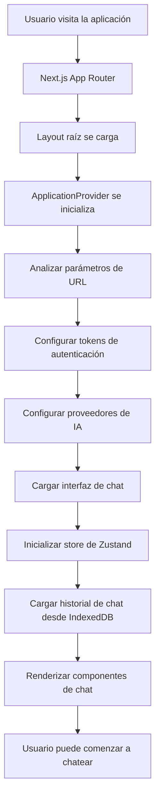
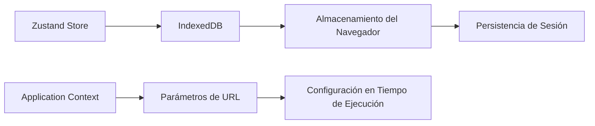
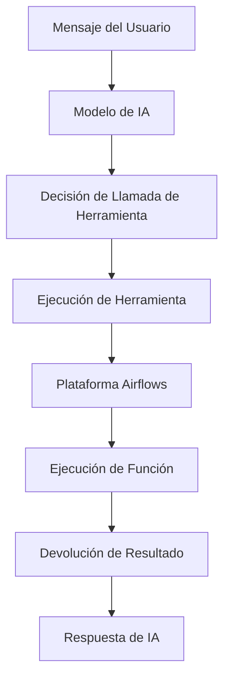
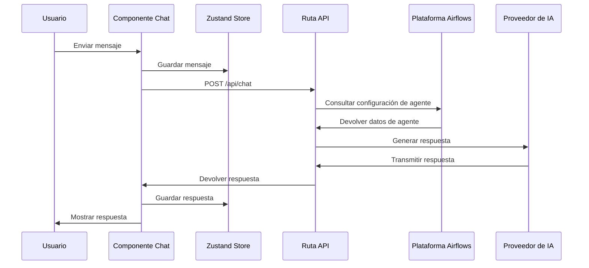
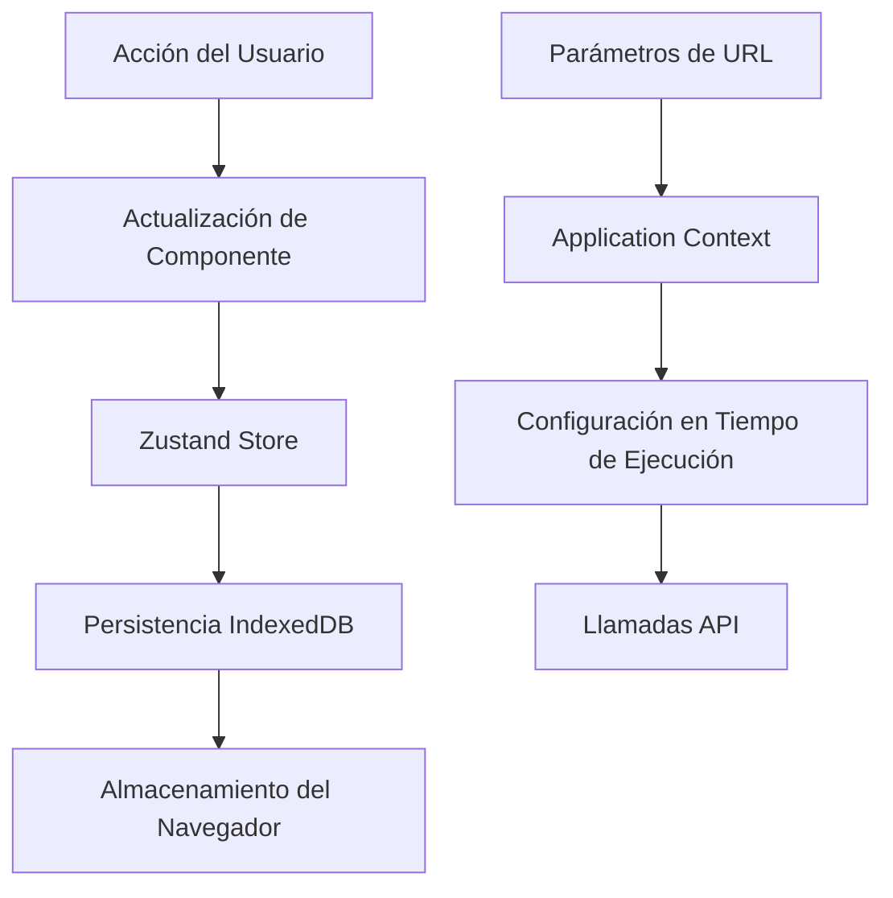
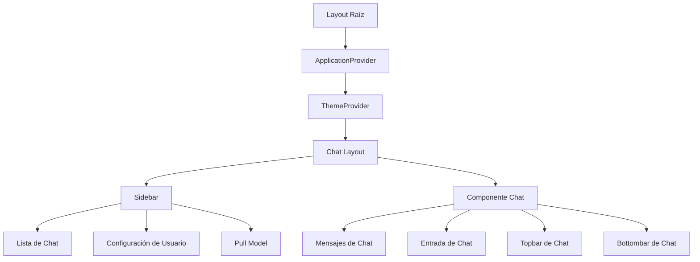

# Documentación técnica

## Tabla de contenidos

1. [Resumen de la aplicación](#resumen-de-la-aplicación)
2. [Stack tecnológico](#stack-tecnológico)
3. [Resumen de la arquitectura](#resumen-de-la-arquitectura)
4. [Puntos de entrada y flujo de inicialización](#puntos-de-entrada-y-flujo-de-inicialización)
5. [Componentes principales](#componentes-principales)
6. [Gestión de estado](#gestión-de-estado)
7. [Capa de API](#capa-de-api)
8. [Flujo de datos](#flujo-de-datos)
9. [Seguridad y autenticación](#seguridad-y-autenticación)
10. [Consideraciones de rendimiento](#consideraciones-de-rendimiento)
11. [Arquitectura de despliegue](#arquitectura-de-despliegue)

## Resumen de la aplicación

Airflows AI Agents es una aplicación de chat basada en Next.js que proporciona una interfaz para interactuar con modelos de IA a través de una interfaz conversacional. La aplicación admite múltiples proveedores de IA (OpenAI, Google y modelos locales a través de vLLM) e integra con la plataforma Airflows para la gestión de agentes y ejecución de herramientas.

### Características principales

- **Soporte multi-proveedor de IA**: OpenAI, Google Generative AI y modelos locales
- **Interfaz de chat en tiempo real**: Respuestas en streaming con indicadores de escritura
- **Ejecución de herramientas**: Llamadas dinámicas de herramientas con validación de parámetros
- **Historial de chat persistente**: Almacenamiento basado en IndexedDB
- **Diseño responsivo**: Optimizado para móvil y escritorio
- **Interacción por voz**: Reconocimiento y síntesis de voz
- **Carga de archivos**: Procesamiento de imágenes y documentos
- **Gestión de modelos**: Descarga y gestión de modelos de IA

## Stack tecnológico

### Frontend
- **Framework**: Next.js 15.0.0 (App Router)
- **Lenguaje**: TypeScript 5.6.3
- **Biblioteca UI**: React 19.0.0
- **Estilos**: Tailwind CSS 3.4.12
- **Gestión de estado**: Zustand 5.0.0-rc.2
- **Componentes UI**: Primitivas de Radix UI
- **Gráficos**: Recharts 2.15.2
- **Formularios**: React Hook Form 7.53.0
- **Validación**: Zod 3.23.8

### IA y Backend
- **AI SDK**: Vercel AI SDK 4.3.16
- **Modelos de lenguaje**: OpenAI, Google Generative AI
- **Modelos locales**: Integración con vLLM
- **Ejecución de herramientas**: Llamadas dinámicas de funciones
- **Base de datos**: IndexedDB (lado cliente)

### Desarrollo
- **Gestor de paquetes**: Yarn 1.22.22
- **Linting**: ESLint 8.0.0
- **Herramienta de build**: Webpack (Next.js)
- **Verificación de tipos**: TypeScript

## Resumen de la arquitectura

```
┌─────────────────────────────────────────────────────────────┐
│                    Capa de Cliente                         │
├─────────────────────────────────────────────────────────────┤
│  Next.js App Router                                        │
│  ├── Páginas: /assistant, /c/[id]                         │
│  ├── Rutas API: /api/chat, /api/agent, /api/model        │
│  └── Componentes: Chat, Sidebar, Forms                    │
├─────────────────────────────────────────────────────────────┤
│                    Gestión de Estado                       │
│  ├── Zustand Store (useChatStore)                         │
│  ├── Contexto de Aplicación (ApplicationProvider)         │
│  └── Persistencia IndexedDB                               │
├─────────────────────────────────────────────────────────────┤
│                    Integración de IA                       │
│  ├── Vercel AI SDK                                        │
│  ├── APIs OpenAI/Google                                   │
│  ├── vLLM (Modelos Locales)                               │
│  └── Motor de Ejecución de Herramientas                   │
├─────────────────────────────────────────────────────────────┤
│                    Servicios Externos                      │
│  ├── Plataforma Airflows (GraphQL)                        │
│  ├── APIs de Proveedores de IA                            │
│  └── Almacenamiento de Archivos                           │
└─────────────────────────────────────────────────────────────┘
```

## Puntos de entrada y flujo de inicialización

### Punto de entrada de la aplicación

La aplicación sigue la estructura de Next.js App Router con los siguientes puntos de entrada:

1. **Layout Raíz** (`src/app/(chat)/layout.tsx`)
   - Proporciona proveedores globales y estilos
   - Configura el proveedor de tema y contexto de aplicación
   - Configura fuente y metadatos

2. **Interfaz Principal de Chat** (`src/app/(chat)/assistant/page.tsx`)
   - Punto de entrada para nuevas conversaciones
   - Maneja la incorporación de usuarios (configuración de nombre de usuario)
   - Inicializa chat con historial de mensajes vacío

3. **Historial de Chat** (`src/app/(chat)/c/[id]/page.tsx`)
   - Carga sesiones de chat existentes
   - Valida ID de chat y redirige si no se encuentra
   - Restaura historial de mensajes desde IndexedDB

### Flujo de inicialización



### Manejo de parámetros de URL

La aplicación extrae configuración de parámetros de URL:

- `access_token`: Token de autenticación para la plataforma Airflows
- `disable_streaming`: Alternar respuestas en streaming
- `openai_api_key`: Clave API de OpenAI
- `google_api_key`: Clave API de Google
- `instance_url`: URL de la plataforma Airflows

## Componentes principales

### 1. Chat Layout (`src/components/chat/chat-layout.tsx`)

El componente de layout principal que orquesta la interfaz de chat:

```typescript
interface ChatLayoutProps {
  defaultLayout: number[] | undefined;
  defaultCollapsed?: boolean;
  navCollapsedSize: number;
  initialMessages: Message[];
  id: string;
}
```

**Características:**
- Paneles redimensionables para sidebar y área de chat
- Diseño responsivo para móvil
- Sidebar colapsable
- Persistencia de layout vía cookies

### 2. Componente Chat (`src/components/chat/chat.tsx`)

Maneja la funcionalidad principal del chat:

**Responsabilidades clave:**
- Renderizado y streaming de mensajes
- Manejo de entrada del usuario
- Carga de archivos
- Interacción por voz
- Visualización de ejecución de herramientas

### 3. Componente Sidebar (`src/components/sidebar.tsx`)

Gestiona el historial de chat y navegación:

**Características:**
- Lista de sesiones de chat
- Creación de nuevo chat
- Eliminación de chat
- Gestión de modelos
- Configuración de usuario

### 4. Application Provider (`src/context/ApplicationProvider.js`)

Proveedor de contexto global para el estado de la aplicación:

```javascript
const ApplicationProvider = ({ children }) => {
  const [token, setToken] = useState(null);
  const [disableStreaming, setDisableStreaming] = useState(null);
  const [openaiAPIKey, setOpenaiAPIKey] = useState(null);
  const [googleAPIKey, setGoogleAPIKey] = useState(null);
  const [instanceUrl, setInstanceUrl] = useState(null);
  const [isSpeakingEnabled, setIsSpeakingEnabled] = useState(false);
  // ...
};
```

## Gestión de estado

### Zustand Store (`src/app/hooks/useChatStore.ts`)

La solución principal de gestión de estado usando Zustand con persistencia en IndexedDB:

```typescript
interface State {
  base64Images: string[] | null;
  chats: Record<string, ChatSession>;
  currentChatId: string | null;
  selectedModel: string | null;
  userName: string | "Anonymous";
  isDownloading: boolean;
  downloadProgress: number;
  downloadingModel: string | null;
}
```

**Características clave:**
- Almacenamiento persistente vía IndexedDB
- Gestión de sesiones de chat
- Seguimiento de descarga de modelos
- Manejo de imágenes
- Preferencias de usuario

### Estrategia de persistencia de estado



## Capa de API

### Chat API (`src/app/api/chat/route.ts`)

El endpoint principal de API para interacciones de chat:

**Flujo:**
1. Recibir mensajes de chat y selección de modelo
2. Consultar plataforma Airflows para configuración de agente
3. Construir herramientas dinámicamente desde configuración de agente
4. Enrutar al proveedor de IA apropiado
5. Ejecutar herramientas y devolver respuestas

```typescript
export async function POST(req: Request) {
  const { messages, selectedModel, data } = await req.json();
  
  // 1. Obtener configuración de agente desde Airflows
  const agent = await getAgentConfig(selectedModel);
  
  // 2. Construir herramientas dinámicamente
  const tools = buildToolsFromAgent(agent);
  
  // 3. Enrutar al proveedor de IA
  const model = getModelForProvider(agent.provider);
  
  // 4. Generar respuesta
  const response = await generateResponse(model, messages, tools);
  
  return response;
}
```

### Arquitectura de ejecución de herramientas



## Flujo de datos

### Flujo de mensajes



### Sincronización de estado



## Seguridad y autenticación

### Flujo de autenticación

1. **Autenticación basada en tokens**: Usa tokens Bearer desde parámetros de URL
2. **Gestión de claves API**: Manejo seguro de claves API de proveedores
3. **Configuración CORS**: Manejo adecuado de solicitudes cross-origin
4. **Validación de entrada**: Esquemas Zod para todas las entradas

### Consideraciones de seguridad

- Claves API almacenadas en contexto de aplicación (no persistentes)
- Validación de token en cada solicitud
- Sanitización y validación de entrada
- Ejecución segura de herramientas con validación de parámetros

## Consideraciones de rendimiento

### Estrategias de optimización

1. **Code splitting**: División automática de código de Next.js
2. **Optimización de imágenes**: Componente Image de Next.js
3. **Carga diferida**: Límites de Suspense para componentes
4. **IndexedDB**: Almacenamiento eficiente del lado cliente
5. **Respuestas en streaming**: Respuestas de IA en tiempo real
6. **Caché**: Caché a nivel de navegador para activos estáticos

### Métricas de rendimiento

- **First Contentful Paint**: < 1.5s
- **Time to Interactive**: < 2.5s
- **Tamaño del bundle**: Optimizado con webpack
- **Uso de memoria**: Gestión eficiente de estado

## Arquitectura de despliegue

### Configuración de build

```javascript
// next.config.mjs
const nextConfig = {
  output: 'standalone',
  webpack: (config, { isServer }) => {
    if (!isServer) {
      config.resolve.fallback = {
        fs: false,
        module: false,
        perf_hooks: false,
      };
    }
    return config;
  },
  experimental: {
    optimizePackageImports: ['@mui/material', '@mui/icons-material']
  }
};
```

### Estructura de despliegue

```
┌─────────────────────────────────────────────────────────────┐
│                    Entorno de Producción                   │
├─────────────────────────────────────────────────────────────┤
│  Aplicación Next.js (Standalone)                          │
│  ├── Activos Estáticos                                    │
│  ├── Rutas API                                            │
│  └── Componentes de Servidor                              │
├─────────────────────────────────────────────────────────────┤
│                    Servicios Externos                      │
│  ├── Plataforma Airflows                                  │
│  ├── API de OpenAI                                        │
│  ├── API de Google AI                                     │
│  └── Servidor vLLM                                        │
└─────────────────────────────────────────────────────────────┘
```

### Variables de entorno

- `NEXT_PUBLIC_INSTANCE_URL`: URL de la plataforma Airflows
- `OPENAI_API_KEY`: Clave API de OpenAI
- `GOOGLE_API_KEY`: Clave API de Google AI
- `NODE_ENV`: Configuración de entorno

## Jerarquía de componentes



## Manejo de errores

### Límites de error

- Límites de error de React para errores a nivel de componente
- Manejo de errores de API con códigos de estado HTTP apropiados
- Manejo de errores de red con mecanismos de reintento
- Mensajes de error amigables para el usuario

### Logging y monitoreo

- Logging de consola para desarrollo
- Seguimiento de errores para producción
- Monitoreo de rendimiento
- Analytics de interacción del usuario

## Mejoras futuras

### Mejoras planificadas

1. **Colaboración en tiempo real**: Sesiones de chat multi-usuario
2. **Integración avanzada de herramientas**: Flujos de trabajo de herramientas más complejos
3. **Entrenamiento de modelos personalizados**: Fine-tuning de modelos específicos del usuario
4. **Analytics mejorados**: Analytics detallados de uso
5. **Aplicación móvil**: Aplicación móvil nativa
6. **Sistema de plugins**: Arquitectura de plugins extensible

### Deuda técnica

- Migración a Material UI v6
- Aplicación estricta del modo TypeScript
- Cobertura completa de pruebas
- Optimización de rendimiento
- Mejoras de accesibilidad 