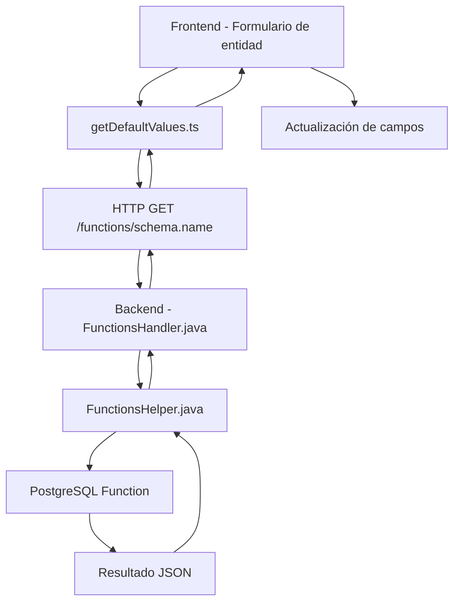

# Funcionalidad de valores por defecto

## Introducción

La funcionalidad de valores por defecto permite calcular automáticamente valores iniciales para los atributos de una entidad basándose en lógica personalizada implementada mediante funciones. Esta característica proporciona un mecanismo potente y flexible para establecer valores contextuales que pueden depender de otros campos, datos del usuario, o consultas a la base de datos.

## Vista funcional

### Propósito y beneficios

La funcionalidad de valores por defecto está diseñada para:

- **Automatizar la entrada de datos**: Reducir la carga manual del usuario pre-llenando campos con valores calculados
- **Garantizar consistencia**: Asegurar que los valores por defecto sigan reglas de negocio específicas
- **Mejorar la experiencia del usuario**: Proporcionar valores contextuales relevantes basados en selecciones previas
- **Mantener integridad de datos**: Aplicar validaciones y cálculos complejos automáticamente

### Casos de uso típicos

1. **Asignación automática de códigos**: Generar códigos únicos basados en patrones específicos
2. **Valores dependientes del usuario**: Establecer valores por defecto según el usuario actual o su rol
3. **Cálculos basados en fechas**: Aplicar fechas de vencimiento, períodos de validez, etc.
4. **Valores derivados de otros campos**: Calcular totales, aplicar descuentos, determinar estados

### Flujo de trabajo del usuario

1. **Configuración de la función**:
   - El administrador navega a **Models > Functions**
   - Crea una nueva función con los parámetros necesarios
   - Define la lógica de cálculo en el campo `contents`

2. **Vinculación a la entidad**:
   - Accede a **Models > Entity**
   - Selecciona la entidad objetivo
   - En la pestaña **UI**, selecciona la función en "Function via default values"

3. **Uso en tiempo de ejecución**:
   - Al crear un nuevo registro, los valores se calculan automáticamente
   - Cuando cambian campos que son parámetros de la función, los valores se recalculan dinámicamente

## Vista técnica

### Arquitectura del sistema

La funcionalidad se implementa mediante varios componentes interconectados:



### Componentes principales

#### 1. Configuración de la función (`Models.Function`)

La tabla `Models.Function` almacena las definiciones de funciones con estos campos críticos:

**Estructura de la tabla** (`/com.niledb.platform/misc/model/create.sql`, líneas 1859-1871):

```sql
CREATE TABLE "Models"."Function" (
    "id" serial PRIMARY KEY,
    "schema" text NOT NULL CHECK ("schema" SIMILAR TO '[_A-Za-z][_0-9A-Za-z]*'),
    "name" text NOT NULL CHECK ("name" SIMILAR TO '[_A-Za-z][_0-9A-Za-z]*'),
    "language" "Models"."languageType" NOT NULL,
    "contents" text NOT NULL,
    "cronExpression" text,
    "isHttpEnabled" boolean NOT NULL DEFAULT false,
    "documentation" text,
    "jobid" int,
    "search" text,
    "timestamp" timestamp NOT NULL DEFAULT now()
);
```

**Campos adicionales para funciones personalizadas** (añadidos en `/com.niledb.platform/misc/model/sql/deltas/97.sql`):

```sql
ALTER TABLE "Models"."Function" ADD COLUMN "isCustomFunction" boolean NOT NULL DEFAULT false;
ALTER TABLE "Models"."Function" ADD COLUMN "customParameters" text;
ALTER TABLE "Models"."Function" ADD COLUMN "customReturnType" text;
```

**Campos esenciales para valores por defecto**:
- **`isHttpEnabled`**: Debe ser `true` para permitir acceso HTTP
- **`isCustomFunction`**: Debe ser `true` para habilitar parámetros personalizados
- **`customParameters`**: Define los parámetros de entrada (formato: "param1 tipo1, param2 tipo2")
- **`customReturnType`**: Tipo de retorno (típicamente "json")
- **`contents`**: Código de la función

#### 2. Vinculación de entidades

La relación entre entidades y funciones se establece mediante un campo de clave foránea añadido en `/com.niledb.platform/misc/model/sql/deltas/113.sql`:

```sql
ALTER TABLE "Models"."Entity" ADD COLUMN "defaultValues" int;
ALTER TABLE "Models"."Entity" ADD CONSTRAINT "defaultValues" FOREIGN KEY ("defaultValues") REFERENCES "Models"."Function"("id") ON DELETE SET NULL;
```

En el frontend (`/com.niledb.platform/admin-tool/src/localModel.js`):
- Campo `defaultValues`: Almacena el ID de la función (oculto en UI)
- Campo `FunctionViaDefaultValues`: Campo de referencia visible para selección

#### 3. Gestión de funciones en el backend (`FunctionsHelper.java`)

El archivo `/com.niledb.platform/src/main/java/helpers/FunctionsHelper.java` gestiona la carga y el almacenamiento en caché de las funciones:

**Estructuras de datos para funciones personalizadas**:
```java
public static HashMap<String, Boolean> plCustomFunctions = new HashMap<String, Boolean>();
public static HashMap<String, String> plCustomFunctionsParameters = new HashMap<String, String>();
public static HashMap<String, String> plCustomFunctionsReturnType = new HashMap<String, String>();
```

**Carga de funciones** (líneas 150-173):
```java
PreparedStatement ps = connection.prepareStatement(
    "SELECT schema, name, contents, \"cronExpression\", \"isHttpEnabled\", \"interceptHttpRequests\", \"interceptSelects\", \"isCustomFunction\", \"customParameters\", \"customReturnType\" FROM \"Models\".\"Function\" WHERE language = 'plpython3u' OR language = 'plpgsql'");
ResultSet rs = ps.executeQuery();

while (rs.next()) {
    String schema = rs.getString("schema");
    String name = rs.getString("name");
    boolean isCustomFunction = rs.getBoolean("isCustomFunction");
    String customParameters = rs.getString("customParameters");
    String customReturnType = rs.getString("customReturnType");
    
    plCustomFunctions.put(schema + "." + name, isCustomFunction);
    plCustomFunctionsParameters.put(schema + "." + name, customParameters);
    plCustomFunctionsReturnType.put(schema + "." + name, customReturnType);
}
```

#### 4. Ejecución HTTP de funciones (`FunctionsHandler.java`)

El archivo `/com.niledb.platform/src/main/java/helpers/FunctionsHandler.java` maneja la ejecución de funciones vía HTTP:

**Configuración de rutas** (`/com.niledb.platform/src/main/java/verticles/HttpVerticle.java`, líneas 227-229):
```java
router.get("/functions/:functionName").blockingHandler(FunctionsHandler::execute);
router.post("/functions/:functionName").handler(BodyHandler.create())
    .blockingHandler(FunctionsHandler::execute);
```

**Procesamiento de parámetros personalizados** (líneas 71-104):
```java
if (FunctionsHelper.plCustomFunctions.get(functionName)
    && FunctionsHelper.plCustomFunctionsParameters.get(functionName) != null) {
    String[] parameters = FunctionsHelper.plCustomFunctionsParameters.get(
        functionName).split(",");

    parameterNames = new String[parameters.length];
    parameterTypes = new String[parameters.length];
    parameterValues = new Object[parameters.length];

    for (int i = 0; i < parameters.length; i++) {
        parameters[i] = parameters[i].trim().replaceAll("\"", "").trim();
        parameterNames[i] = parameters[i].split("\\s+")[0];
        parameterTypes[i] = parameters[i].split("\\s+")[1];

        Object jsonValue = jsonBody != null ? jsonBody.getValue(parameterNames[i]) : null;
        String headerValue = request.getHeader(parameterNames[i]);
        String parameterValue = request.getParam(parameterNames[i]);

        parameterValues[i] = jsonValue != null ? jsonValue
            : (parameterValue != null ? parameterValue : headerValue);

        if (parameterNames[i].equals("access_token")) {
            parameterValues[i] = afCtx.getToken();
        }
    }
}
```

**Ejecución de la función en base de datos** (líneas 130-195):
```java
PreparedStatement ps = connection.prepareStatement(
    "SELECT \"" + functionName.split("\\.")[0] + "\".\"" + functionName.split("\\.")[1] + "\"(" +
    (parameterNames != null ? String.join(",", Arrays.stream(new String[parameterNames.length])
    .map(x -> "?").toArray(String[]::new)) : "") + ") as \"result\"");

if (parameterNames != null) {
    for (int i = 0; i < parameterNames.length; i++) {
        if (parameterValues[i] != null) {
            switch (parameterTypes[i]) {
                case "text":
                    ps.setObject(i + 1, parameterValues[i], Types.VARCHAR);
                    break;
                case "int":
                    ps.setObject(i + 1, parameterValues[i], Types.INTEGER);
                    break;
                case "numeric":
                    ps.setObject(i + 1, parameterValues[i], Types.NUMERIC);
                    break;
                case "boolean":
                    ps.setObject(i + 1, parameterValues[i], Types.BOOLEAN);
                    break;
                case "date":
                    ps.setObject(i + 1, parameterValues[i], Types.DATE);
                    break;
                default:
                    ps.setObject(i + 1, parameterValues[i], Types.VARCHAR);
                    break;
            }
        } else {
            // Manejo de valores nulos con tipos específicos
        }
    }
}
```

#### 5. Creación automática de funciones en PostgreSQL

El sistema sincroniza automáticamente las funciones definidas en `Models.Function` con PostgreSQL mediante el proceso de sincronización (archivos en `/com.niledb.platform/misc/model/sql/deltas/`):

**Creación de funciones personalizadas** (delta 104.sql, líneas 1365-1366):
```sql
ELSIF function."isCustomFunction" THEN
    EXECUTE 'CREATE OR REPLACE FUNCTION "' || function.schema || '"."' || function.name || '"(' || 
    CASE function."customParameters" IS NULL WHEN TRUE THEN '' ELSE function."customParameters" END ||  
    ')' || CASE function."customReturnType" IS NULL WHEN TRUE THEN '' ELSE ' RETURNS ' || function."customReturnType" END || 
    ' AS $func$' || function.contents || '$func$ LANGUAGE ' || function.language;
```

#### 6. Ejecución de funciones (`getDefaultValues.ts`)

```typescript
export const getDefaultValues = async ({
  defaultValues,
  data = {},
}: {
  defaultValues: {
    schema?: string | null
    name?: string | null
    customParameters?: string | null
  }
  data?: Record<string, any>
}): Promise<Record<string, any>>
```

**Proceso de ejecución**:

1. **Parseo de parámetros**: Convierte la cadena `customParameters` en objetos clave-tipo
2. **Preparación de headers**: Pasa los valores de parámetros como headers HTTP
3. **Solicitud HTTP**: Realiza GET a `/functions/{schema}.{functionName}`
4. **Procesamiento de respuesta**: Parsea el JSON retornado por la función

#### 7. Integración en el ciclo de vida de la entidad

##### Carga inicial (`useLoadEntityState.ts`)

```typescript
// Set default values for attributes with default values
const defaultValues = entityLocalModel.defaultValues
if (defaultValues) {
  const [error, result] = await catchError(
    getDefaultValues({
      defaultValues,
    }),
  )
  
  if (error) {
    showNetworkErrorMessage(error)
  } else {
    // Apply default values to entity data
    const filteredAttributes = attributes.filter((attribute) => result[attribute.name])
    for (const attribute of filteredAttributes) {
      let resultValue = result[attribute.name]
      if (`${resultValue}`.trim() === 'now()') {
        resultValue = format(new Date(), attributeTypeToDateFNSFormat(attribute.type ?? ''))
      }
      data[attribute.name] = resultValue
        ? resultValue
        : calculateDefaultValue(attribute, entityLocalModel)
    }
  }
}
```

##### Recálculo dinámico (`DirectReferenceField.tsx`)

```typescript
const handleDefaultValueChange = async (value: unknown) => {
  // Parse custom parameters
  const customParameters: string[] =
    entityLocalModel.defaultValues?.customParameters?.split(',') || []

  const customParametersMap = customParameters.map((param: string) => {
    const [key, type] = param.split(' ')
    return { key, type }
  })

  const customParameterKeys = Array.isArray(customParametersMap)
    ? customParametersMap.map((param) => param.key)
    : []

  // Check if current field is a parameter field
  if (customParameterKeys.includes(attribute.name) && valueChanged) {
    // Collect current form values
    const currentData = getEntityFormValues()
    const dataToDefaultValues: Record<string, string> = {}
    customParameterKeys.forEach((param: string) => {
      if (currentData[param]) {
        dataToDefaultValues[param] = extractValue(currentData[param])
      }
    })

    // Recalculate default values
    const [error, values] = await catchError(
      getDefaultValues({
        defaultValues: entityLocalModel.defaultValues,
        data: dataToDefaultValues,
      }),
    )

    if (!error) {
      // Update all affected fields
      Object.entries(values).forEach(([key, value]) => {
        setEntityFormValue(key, value)
      })
    }
  }
}
```

### Especificaciones técnicas del backend

#### Manejo de tipos de datos

El backend soporta los siguientes tipos de parámetros:

- **text**: Cadenas de texto (VARCHAR)
- **int**: Enteros (INTEGER)
- **numeric**: Números decimales (NUMERIC)
- **boolean**: Valores booleanos (BOOLEAN)
- **date**: Fechas (DATE)

#### Seguridad y autenticación

- **Token de acceso**: Los parámetros `access_token` se reemplazan automáticamente con el token del contexto de la solicitud
- **Validación de funciones**: Solo las funciones con `isHttpEnabled = true` son accesibles vía HTTP
- **Contexto de usuario**: El backend tiene acceso al contexto de autenticación (`AirflowsRequestContext`)

#### Gestión de errores

**Manejo de excepciones** (`FunctionsHandler.java`, líneas 214-222):
```java
catch (Exception e) {
    log.error("Error in FunctionsHandler.execute: ", e);
    JsonObject responseJson = new JsonObject()
        .put("exceptionMessage", e.getMessage());
    routingContext.response()
        .putHeader("Content-Type", "application/json")
        .setStatusCode(500)
        .end(responseJson.encode());
}
```

#### Optimizaciones de rendimiento

**Refactorización de ejecución directa**: El sistema incluye documentación sobre una refactorización para eliminar llamadas HTTP innecesarias (`function-execution-refactoring.md`):

- **Problema**: Las llamadas HTTP internas generan overhead innecesario
- **Solución**: Implementación de `DirectFunctionExecutor` para llamadas directas
- **Beneficios**: Reducción de 50-90% en latencia, menor uso de memoria y CPU

### Formato de parámetros

Los parámetros se definen como una cadena separada por comas:
```
"userId int, companyId text, departmentId int"
```

Se parsea en:
```typescript
[
  { key: "userId", type: "int" },
  { key: "companyId", type: "text" },
  { key: "departmentId", type: "int" }
]
```

### Estructura de función PLpgSQL

```sql
DECLARE
    result json;
BEGIN
    -- Lógica de cálculo personalizada
    SELECT json_build_object(
        'orderDate', CURRENT_DATE,
        'status', 'PENDING',
        'assignedTo', userId,
        'priority', CASE 
            WHEN companyId = 'VIP' THEN 'HIGH'
            ELSE 'NORMAL'
        END,
        'companyCode', companyId
    ) INTO result;
    
    RETURN result;
END;
```

### Protocolo HTTP

- **Método**: GET o POST
- **URL**: `{baseUrl}/functions/{schema}.{functionName}`
- **Headers**: 
  - `Authorization: Bearer {accessToken}`
  - `{parameterName}: {parameterValue}` (para cada parámetro)
- **Content-Type**: `application/json` (para POST con body)

### Formato de respuesta

```json
[
  {
    "result": "{\"orderDate\": \"2024-01-15\", \"status\": \"PENDING\", \"assignedTo\": 123}"
  }
]
```

### Consideraciones de rendimiento

1. **Caché de funciones**: Las funciones se cargan en memoria al iniciar el servidor (`FunctionsHelper`)
2. **Recálculo selectivo**: Solo se recalcula cuando cambian campos que son parámetros
3. **Ejecución asíncrona**: Las llamadas a funciones no bloquean la interfaz de usuario
4. **Manejo de errores**: Los errores se capturan y muestran mensajes informativos
5. **Pool de conexiones**: Utiliza HikariCP para gestión eficiente de conexiones a la base de datos

### Limitaciones y restricciones

1. **Parámetros como headers**: Los valores de parámetros se pasan como headers HTTP, limitando el tamaño y tipo de datos
2. **Respuesta JSON**: El resultado debe ser un objeto JSON válido
3. **Dependencias de red**: Requiere conectividad para ejecutar funciones remotas (aunque existe refactorización para llamadas directas)
4. **Sincronización**: No hay garantía de orden en la aplicación de múltiples valores calculados
5. **Tipos soportados**: Limitado a los tipos básicos de PostgreSQL (text, int, numeric, boolean, date)

## Configuración paso a paso

### 1. Creación de la función

```sql
-- Ejemplo de función para calcular valores por defecto de pedidos
CREATE OR REPLACE FUNCTION "Sales"."getOrderDefaults"(userId int, companyId text)
RETURNS json
LANGUAGE plpgsql
AS $$
DECLARE
    result json;
    userDepartment text;
    companyDiscount decimal;
BEGIN
    -- Obtener departamento del usuario
    SELECT department INTO userDepartment 
    FROM "Users"."User" 
    WHERE id = userId;
    
    -- Obtener descuento de la empresa
    SELECT discount INTO companyDiscount 
    FROM "Sales"."Company" 
    WHERE code = companyId;
    
    -- Construir resultado
    SELECT json_build_object(
        'orderDate', CURRENT_DATE,
        'deliveryDate', CURRENT_DATE + INTERVAL '7 days',
        'status', 'DRAFT',
        'assignedTo', userId,
        'department', userDepartment,
        'companyCode', companyId,
        'defaultDiscount', COALESCE(companyDiscount, 0.0),
        'priority', CASE 
            WHEN companyId IN ('VIP001', 'VIP002') THEN 'HIGH'
            ELSE 'NORMAL'
        END
    ) INTO result;
    
    RETURN result;
END;
$$;
```

### 2. Configuración en Models.Function

| Campo | Valor |
|-------|-------|
| schema | Sales |
| name | getOrderDefaults |
| language | plpgsql |
| isHttpEnabled | true |
| isCustomFunction | true |
| customParameters | userId int, companyId text |
| customReturnType | json |
| contents | [Código de la función] |

### 3. Vinculación a la entidad

1. Navegar a **Models > Entity**
2. Seleccionar la entidad "Order"
3. Ir a la pestaña **UI** (pestaña 6)
4. En el campo "Function via default values" (orden 21), seleccionar la función creada

### 4. Sincronización automática

El sistema sincronizará automáticamente:
- La función se creará en PostgreSQL con la sintaxis correcta
- Los metadatos se cargarán en `FunctionsHelper`
- La función estará disponible vía HTTP en `/functions/Sales.getOrderDefaults`

### 5. Resultado esperado

Cuando se crea un nuevo pedido:
- Si el usuario selecciona una empresa, se ejecuta automáticamente `getOrderDefaults`
- Los campos se llenan con los valores calculados
- Si cambia la empresa seleccionada, los valores se recalculan dinámicamente

## Arquitectura de backend detallada

### Componentes de sincronización

**Sincronización de funciones**: El archivo `/com.niledb.platform/misc/model/sql/deltas/104.sql` contiene la lógica de sincronización que:

1. Crea esquemas automáticamente
2. Genera funciones PostgreSQL con la sintaxis correcta
3. Maneja diferentes tipos de funciones (triggers, cron jobs, funciones personalizadas)

**Trigger de función** (`/com.niledb.platform/misc/model/sql/deltas/118.sql`):
```sql
CREATE OR REPLACE FUNCTION "Models"."function_trigger"() RETURNS trigger AS $$
DECLARE
    sql text;
BEGIN
    new.search := COALESCE(new."schema", '') || ' ' || COALESCE(new."name", '') || ' ' || COALESCE(new."documentation", '');
    IF (TG_OP = 'UPDATE' AND (cambios en campos relevantes)) THEN
        sql := 'DROP FUNCTION IF EXISTS "' || old."schema" || '"."' || old.name || '"';
        EXECUTE sql;
    END IF;
    new."timestamp" := now();
    new."username" := CURRENT_USER;
    return new; 
END
$$ LANGUAGE plpgsql;
```

### Gestión de importación/exportación

**Importación de funciones** (`/com.niledb.platform/src/main/java/tools/usecase/ModelImportUseCase.java`, líneas 362-369):
```java
PreparedStatement ps = connection.prepareStatement(
    "INSERT INTO \"Models\".\"Function\""
        + " (\"schema\", \"name\", \"language\", \"contents\", \"cronExpression\", \"isHttpEnabled\", \"documentation\", "
        + "  \"interceptHttpRequests\", \"interceptSelects\", \"isCustomFunction\", \"customParameters\", \"customReturnType\") "
        + " VALUES (?, ?, ?::\"Models\".\"languageType\", ?, ?, ?, ?, ?, ?, ?, ?, ?) "
        + " ON CONFLICT (\"schema\", \"name\") "
        + " DO UPDATE SET [campos actualizables]");
```

### Monitoreo y logging

El sistema incluye logging extensivo:
- **FunctionsHandler**: Logs de ejecución de funciones y errores
- **FunctionsHelper**: Logs de carga y sincronización de funciones
- **Debugging**: Impresión de parámetros para depuración

## Mejores prácticas

### Desarrollo de funciones

1. **Manejo de errores**: Incluir validación de parámetros y manejo de casos edge
2. **Performance**: Optimizar consultas para evitar timeouts
3. **Consistencia**: Usar convenciones de nomenclatura consistentes
4. **Documentación**: Documentar la lógica de cálculo en el campo `documentation`
5. **Tipos de retorno**: Siempre retornar JSON válido con estructura consistente

### Configuración de entidades

1. **Parámetros mínimos**: Usar solo los parámetros necesarios para el cálculo
2. **Tipos apropiados**: Especificar tipos de datos correctos en `customParameters`
3. **Validación**: Probar la función con diferentes combinaciones de parámetros
4. **Sincronización**: Verificar que la función se sincroniza correctamente en PostgreSQL

### Experiencia de usuario

1. **Feedback visual**: Mostrar indicadores de carga durante el cálculo
2. **Valores editables**: Permitir que el usuario modifique valores calculados si es necesario
3. **Mensajes de error**: Proporcionar mensajes claros cuando fallan los cálculos
4. **Performance**: Minimizar el tiempo de respuesta de las funciones

### Seguridad

1. **Validación de entrada**: Validar todos los parámetros antes de usar
2. **Escape de SQL**: Usar parámetros preparados para evitar inyección SQL
3. **Acceso controlado**: Solo habilitar HTTP para funciones que lo requieran
4. **Auditoría**: Registrar ejecuciones de funciones críticas

## Troubleshooting

### Problemas comunes

1. **Función no se ejecuta**:
   - Verificar que `isHttpEnabled = true`
   - Verificar que `isCustomFunction = true`
   - Confirmar que la función está vinculada a la entidad
   - Revisar logs del servidor para errores de sincronización

2. **Parámetros no se pasan correctamente**:
   - Revisar formato de `customParameters` (espacios, comas)
   - Verificar que los nombres de campo coincidan exactamente
   - Comprobar que los tipos de datos sean compatibles

3. **Error en la ejecución**:
   - Revisar logs del backend (`FunctionsHandler`)
   - Validar sintaxis de la función en PostgreSQL
   - Verificar permisos de acceso a tablas referenciadas
   - Comprobar que la función retorna JSON válido

4. **Valores no se actualizan dinámicamente**:
   - Confirmar que el campo es uno de los `customParameters`
   - Verificar que el campo es de tipo referencia directa
   - Revisar la lógica de `handleDefaultValueChange`

5. **Problemas de rendimiento**:
   - Optimizar consultas en la función
   - Considerar usar índices en tablas consultadas
   - Evaluar implementar caché si es apropiado
   - Revisar si la refactorización de ejecución directa está disponible

### Debugging del backend

Para debuggear problemas en el backend:

1. **Logs del servidor**: Revisar logs de `FunctionsHandler` y `FunctionsHelper`
2. **Base de datos**: Verificar que la función existe en PostgreSQL
3. **Metadatos**: Comprobar que la función está cargada en `FunctionsHelper`
4. **HTTP**: Probar la función directamente vía `/functions/{schema}.{name}`
5. **Parámetros**: Verificar que los headers HTTP contienen los parámetros correctos

### Debugging del frontend

Para debuggear problemas en el frontend:

1. Revisar la consola del navegador para errores JavaScript
2. Verificar las llamadas de red en las herramientas de desarrollador
3. Comprobar que `getDefaultValues` recibe los parámetros correctos
4. Validar el formato JSON de la respuesta
5. Verificar que los valores se aplican correctamente a los campos

### Herramientas de diagnóstico

1. **Endpoint de prueba**: Acceder directamente a `/functions/{schema}.{name}` con parámetros
2. **Logs estructurados**: Usar los logs del backend para rastrear ejecuciones
3. **Validación de JSON**: Verificar que las funciones retornan JSON válido
4. **Monitoreo de rendimiento**: Medir tiempos de respuesta de funciones

## Conclusión

La funcionalidad de valores por defecto proporciona una herramienta poderosa para automatizar la entrada de datos en los formularios y mejorar la experiencia del usuario. Su implementación flexible permite desde cálculos simples hasta lógica de negocio compleja, manteniendo la separación entre la lógica de presentación y la lógica de dominio.

### Puntos clave del backend

1. **Arquitectura robusta**: Sistema de sincronización automática entre `Models.Function` y PostgreSQL
2. **Flexibilidad**: Soporte para múltiples tipos de datos y parámetros dinámicos
3. **Rendimiento**: Caché en memoria de metadatos de funciones y optimizaciones disponibles
4. **Seguridad**: Validación de acceso y manejo seguro de parámetros
5. **Mantenibilidad**: Logging extensivo y manejo estructurado de errores

