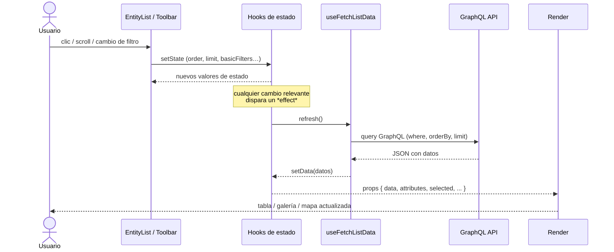

# Flujo de estado y datos 

A continuación se describe cómo fluyen los eventos y la información desde que el usuario interactúa con `EntityList` hasta que se renderiza la nueva UI. El diagrama se centra en el ciclo *interacción → hook → red → renderizado*.



### Pasos

1. **Interacción de usuario**  
   – Click para ordenar, click “Aplicar filtro”, botón “Cargar más”, etc.
2. **Actualización de estado local**  
   – `useHeaderSort`, `useBasicFilterUrl`, `useSearchValueUrl` y/o `setLimit` modifican su estado interno.  
   – Se propagan nuevos `props` a `useFetchListData`.
3. **Efecto de `useFetchListData`**  
   – Detecta cambios relevantes y ejecuta `fetchData()`.  
   – Compone la consulta GraphQL combinando `buildWhere`, `buildOrderBy` y `limit`.
4. **Red / API**  
   – El backend responde con las filas solicitadas.
5. **Actualización del estado**  
   – `setData` actualiza la lista; `loading` pasa a `false`.
6. **Renderizado**  
   – `EntityBody` re-renderiza la vista activa con los nuevos datos.

# Mecanismo de filtrado

El filtrado se implementa como un sistema declarativo, impulsado por metadatos del modelo y sincronizado con la URL.

## Componentes principales

| Componente / Hook | Rol |
|-------------------|-----|
| `EntityFilters` | Renderiza el panel de filtros básicos usando `InputFactory` |
| `InputFactory` | Elige el control adecuado (texto, número, fecha, enum, autocomplete, etc.) según la definición del atributo |
| `useBasicFilterUrl` | Almacena el objeto `basicFilters` en el parámetro de URL `?basicFilters=` usando `nuqs` |
| `buildWhere` | Traduce `basicFilters` a cláusulas `where` de GraphQL |
| `useFetchListData` | Incluye el resultado de `buildWhere` en la consulta y recupera datos |

## Workflow detallado

1. **Activar panel**  
   – El usuario pulsa el icono de embudo en la toolbar.  
   – `basicFiltersEnabled` se alterna y, si es `true`, se muestra `EntityFilters`.

2. **Definir criterios**  
   – Para cada atributo con `basicFilter: true` en el modelo se renderiza un control creado por `InputFactory`.  
   – El usuario rellena valores y decide si cada filtro está habilitado mediante un *checkbox* junto al control.

3. **Aplicar filtros**  
   – Al pulsar «Aplicar», `EntityFilters` llama a `setBasicFilters(enabledFilters)` de `useBasicFilterUrl`.  
   – El objeto resultante (solo filtros habilitados) se serializa en la URL:  
     `?basicFilters={"estado":"ACTIVO","fechaAlta":{"from":"2024-01-01"}}`.

4. **Reacción de `EntityList`**  
   – Como el hook devuelve un valor reactivo, `basicFilters` cambia y provoca un nuevo render en `EntityList`.

5. **Query con filtros**  
   – `useFetchListData` detecta el cambio, llama a `buildWhere` y genera las cláusulas `AND` correspondientes.  
   – Ejemplo de cláusula para fecha:
     ```graphql
     { fechaAlta: { GE: "2024-01-01 00:00:00" } }
     ```
   – Se envía la nueva consulta al backend.

6. **Resultado actualizado**  
   – Los datos filtrados llegan, `data` se actualiza y la vista se refresca.

## Reglas de construcción (`buildWhere`)

- **Textos** → búsqueda de texto completo + `ILIKE` exacto, configurable por idioma.  
  ```ts
  { nombre: { SEARCH: { query: "juan:* & perez:*", config: es_ES } } }
  ```
- **Enum multi-select** → combina `IN` y `IS_NULL` cuando el usuario marca «vacíos».  
- **Rango de fechas/hora** → genera `GE`/`LE` con los límites `from` y `to`.  
- **Numéricos y booleanos** → comparación directa con `EQ`.  
- **Referencias** → filtra por `EQ` del identificador de la entidad referenciada.

## Toggle “filtrar cuando está vacío”

En la toolbar, algunas entidades relacionales exponen un *checkbox* «Mostrar solo X con Y».  
Cuando el usuario lo activa:  
1. `onFilterWhenEmptyClick(entityName)` actualiza `filterWhenEmptyDict`.  
2. Este diccionario se pasa a `useFetchListData`, que inserta cláusulas adicionales en la consulta utilizando un `INNER JOIN` implícito (`ListVia<>`).  
3. El backend devuelve solo los registros que cumplan la condición “tiene al menos un Y”.

---
