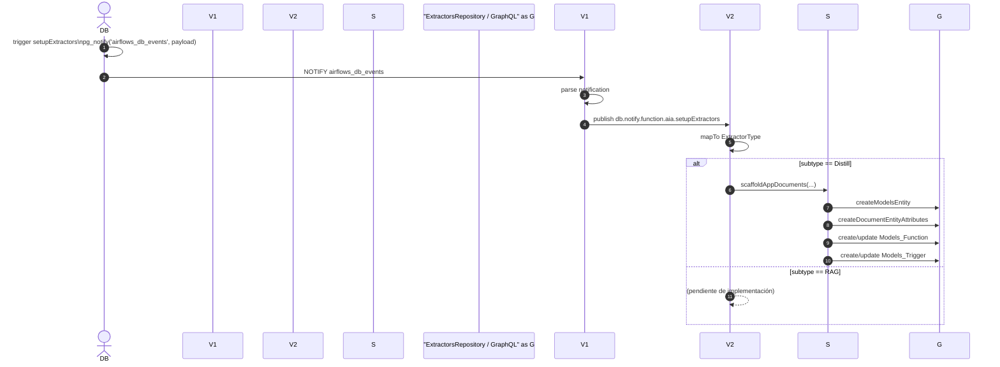
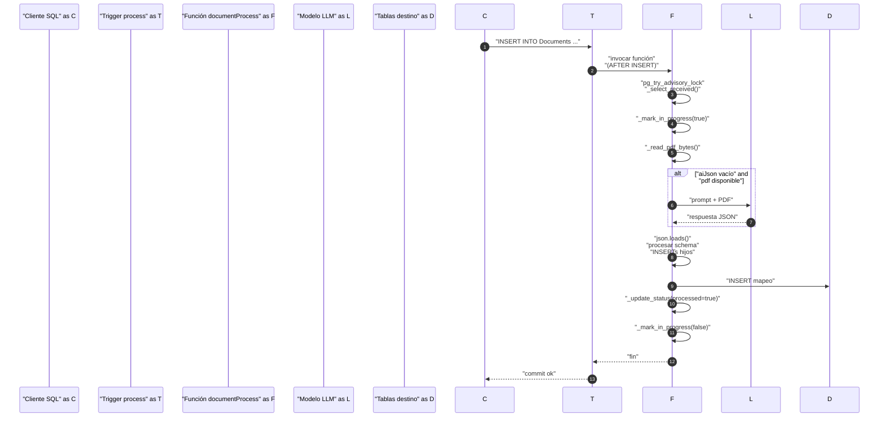

## Nuevo tipo de agente IA : Extractor

## Cambios en el backend

Se ha añadido una vertical para escuchar eventos de la base de datos
DbNotifyVerticle: vertical para eschar notificaciones de postgresql
ExtractorEventsVerticle: vertical que escucha por eventBus eventos de cambio en
aia.Agent
Esto se ha hecho para poder configurar los extractores

## Cambios en el modelo

model/applications/aia/entities/Agent.airflows
NEW PROPERTIES:

attribute distillPreprocessFunction {
    group: extractor
    label en_US: "Preprocess function"
    length: 100
    order: 40
    type: TEXT
    variants: "Distill"
    visible
}
attribute distillRagAppName {
    group: extractor
    label en_US: "Application name"
    length: 100
    order: 10
    type: TEXT
    variants: "Distill" "RAG"
    visible
}
attribute distillRagFileMask {
    group: extractor
    label en_US: "File mask"
    length: 100
    order: 30
    type: TEXT
    variants: "Distill" "RAG"
    visible
}
attribute distillConversionRules {
    group: extractor
    label en_US: "Conversion rules"
    length: 20000
    multiline
    order: 50
    type: TEXT
    variants: "Distill"
    visible
}
attribute distillJsonSchema {
    group: extractor
    label en_US: "Json schema"
    length: 20000
    multiline
    order: 60
    type: TEXT
    variants: "Distill"
    visible
}
attribute distillRagCronExpression {
    group: extractor
    label en_US: "CRON expression"
    length: 100
    order: 70
    type: TEXT
    variants: "Distill" "RAG"
    visible
}
attribute distillRagRunOnInsert {
    firstInRow
    group: extractor
    label en_US: "Run on insert"
    length: 100
    order: 80
    type: BOOLEAN
    variants: "Distill" "RAG"
    visible
}
attribute distillRagRunOnUpdate {
    firstInRow
    group: extractor
    label en_US: "Run on update"
    length: 100
    order: 90
    type: BOOLEAN
    variants: "Distill" "RAG"
    visible
}
attribute ragResultNumber {
    firstInRow
    group: extractor
    label en_US: "Result number"
    length: 100
    order: 40
    type: INTEGER
    variants: "RAG"
    visible
}
attribute distillRagFileType {
    enumType: aia.DistillFileType
    firstInRow
    group: extractor
    label en_US: "File type"
    length: 100
    order: 20
    type: TEXT
    variants: "Distill" "RAG"
    visible
}
attribute extractorSubType {
    enumType: aia.ExtractorSubType
    label en_US: "Extractor type"
    length: 100
    order: 6
    type: TEXT
    variants: "Extractor"
    variantSelector
    visible
}
group extractor {
    label en_US: "Extractor"
}

trigger setupExtractors {
    each: ROW
    events: INSERT UPDATE
    function: aia.setupExtractors
    moment: AFTER
}


model/applications/aia/enumTypes/AgentType.airflows
NEW PROPERTIES:
    icons: "assistant" "directions_run" "local_library"
    labels en_US: "Assistant" "Activity" "Extractor"
    values: "Assistant" "Activity" "Extractor"


NEW TYPES:
model/applications/aia/enumTypes/DistillFileType.airflows
enumType aia.DistillFileType {
    labels en_US: "HTML" "PDF" "TXT"
    values: "html" "pdf" "txt"
}


model/applications/aia/enumTypes/ExtractorSubType.airflows
enumType aia.ExtractorSubType {
    labels en_US: "Distill" "RAG"
    values: "Distill" "RAG"
}

model/applications/aia/functions/setupExtractors.airflows
function aia.setupExtractors {
    language: plpgsql
    path: "applications/aia/functions/setupExtractors.pgsql"
}

model/applications/aia/functions/setupExtractors.pgsql
DECLARE
  payload jsonb;
  data jsonb;
BEGIN
  IF NEW."extractorSubType" IS NOT NULL
     AND NEW."extractorSubType" IN ('RAG','Distill') THEN

  data := jsonb_build_object(
      'table', TG_TABLE_NAME,
      'op', TG_OP,                       -- INSERT/UPDATE
      'id', NEW.id,
      'extractorSubType', NEW."extractorSubType",
      'model', NEW."model",
      'appName',         COALESCE(NEW."distillRagAppName",''),
      'cronExpression',     COALESCE(NEW."distillRagCronExpression",''),
      'fileMask',           COALESCE(NEW."distillRagFileMask",''),
      'fileType',           COALESCE(NEW."distillRagFileType"::text, ''),
      'runOnInsert',        COALESCE(NEW."distillRagRunOnInsert", false),
      'runOnUpdate',        COALESCE(NEW."distillRagRunOnUpdate", false),
      'distill', jsonb_build_object(
        'conversionRules',    COALESCE(NEW."distillConversionRules",''),
        'jsonSchema',         COALESCE(NEW."distillJsonSchema",''),
        'preprocessFunction', COALESCE(NEW."distillPreprocessFunction",'')
      ),
      'rag', jsonb_build_object(
        'resultNumber',    COALESCE(NEW."ragResultNumber",0)
      ),
      'at', to_char(clock_timestamp(), 'YYYY-MM-DD"T"HH24:MI:SS.MS"Z"')
    );

    payload := jsonb_build_object(
      'type', 'function.aia.setupExtractors',
      'data', data
    );

    PERFORM pg_notify('airflows_db_events', payload::text);
  END IF;

  RETURN NEW;
END;

## Estado funcional actual

Para distill
es capaz de crear el formulario de document
es capaz de crear la función de procesado de document
es capaz de actualizar la función
ejemplo de conversion rules y schema
conversion rules
{
  "prompt": "Extrae metadatos. Devuelve JSON con {metadata:
{title,summary}}. Si falta algo, deja vacío.",
  "dateFormats": ["yyyy-MM-dd","dd/MM/yyyy"],
  "coerce": { "clauses[].pos": "int" },
  "valueMaps": { "metadata.lang": { "ES":"es", "EN":"en" } }
}
json schema
{
  "entity": "ReglamentoRunning.procesado",
  "fields": [
    {"name": "titulo",   "source": "metadata.title"},
    {"name": "resumen", "source": "metadata.summary"}
  ]
}
Para RAG
es capa de crear el formulario de document
es capaz de leer los documentos, pasarlos por tika y recoger el texto
faltan los embeddings
el procesado de tika se hace en el backend en lugar de en la función
existe una función que escucha los cambios en el formulario
la función dispara un evento "rag_process_document"
hay un verticle que se encarga de hacer el trabajo
RagExtractDocumentServiceVerticle

## Documentación
[14 tools called]

flujo completo del nuevo agente “Extractor”  
================================================

1. evento en base de datos  
   • Archivo: `model/applications/aia/functions/setupExtractors.pgsql`  
   • El trigger `setupExtractors` (definido en el entity `Agent.airflows`) llama a esta función cuando se inserta o actualiza un agente con `extractorSubType = 'Distill' | 'RAG'`.  
   • La función construye un JSON con todos los parámetros del agente y lo envía vía `pg_notify('airflows_db_events', payload)` con `type = 'function.aia.setupExtractors'`.

2. recepción de la notificación en vert.x  
   • `verticles/DbNotifyVerticle.java`  
     – Se suscribe a *todas* las notificaciones SQL, las decodifica y las vuelve a publicar en el event-bus local:  
       `"db.notify." + type`  
   • Para nuestro caso la dirección es `db.notify.function.aia.setupExtractors`.

3. procesamiento del evento extractor  
   • `verticles/features/extractors/ExtractorEventsVerticle.java`  
     – Se despliega desde `verticles/MainVerticle.java`.  
     – Se suscribe a la dirección anterior y transforma el JSON en el record `ExtractorType`.  
     – Si `extractorSubType == "Distill"` invoca `DistillSetupService.scaffoldAppDocuments(...)`.  
     – El código para `RAG` está comentado (todavía pendiente).

4. servicio de scaffolding para “Distill”  
   • `verticles/features/extractors/DistillSetupService.java`  
     – Decide qué hacer según `op` (`INSERT` → crear, `UPDATE` → actualizar).  
     – Pasos de creación (`scaffoldAppDocumentsCreate`):  
       1. `getModelProvider` → busca modelo y proveedor (`OpenAI`, `Google`, …).  
       2. `createModelsEntity` → crea la entidad `<appName>.Documents`.  
       3. `createDocumentEntityAttributes` → añade atributos estándar (`name`, `document`, `processed`, …).  
       4. Genera el cuerpo de la función `documentProcess` con `DistillGenericFunctionBuilder`.  
       5. `createModelsFunction` → crea la función en la DB (lenguaje `plpython3u`).  
       6. `createModelsEntityTrigger` → trigger AFTER INSERT/UPDATE que lanza la función.  
     – Pasos de actualización cambian la función y el trigger existentes.

5. repositorio con operaciones GraphQL/SQL  
   • `verticles/features/extractors/ExtractorsRepository.java`  
     – Implementa todas las mutaciones/consultas GraphQL: crear entidad, atributos, función, trigger, etc.  
     – Incluye `getModelProvider` (consulta SQL directa).

6. generación del código python de conversión  
   • `verticles/features/extractors/DistillGenericFunctionBuilder.java`  
     – Rellena una plantilla con: reglas de conversión, esquema JSON, configuración del modelo LLM, nombre de tabla fuente.  
     – El resultado se guarda en la función `documentProcess` creada en el paso 4.

7. despliegue de verticles  
   • `verticles/MainVerticle.java`  
     – Despliega `DbNotifyVerticle` y, tras él, `ExtractorEventsVerticle`.

archivos principales  
--------------------

```text
com.niledb.platform/src/main/java/verticles/DbNotifyVerticle.java
com.niledb.platform/src/main/java/verticles/MainVerticle.java
com.niledb.platform/src/main/java/verticles/features/extractors/ExtractorEventsVerticle.java
com.niledb.platform/src/main/java/verticles/features/extractors/DistillSetupService.java
com.niledb.platform/src/main/java/verticles/features/extractors/ExtractorsRepository.java
com.niledb.platform/src/main/java/verticles/features/extractors/ExtractorTypes.java
com.niledb.platform/src/main/java/verticles/features/extractors/DistillGenericFunctionBuilder.java
model/applications/aia/entities/Agent.airflows     (nuevos atributos)
model/applications/aia/functions/setupExtractors.pgsql
```

diagrama de secuencia (alto nivel)  
----------------------------------



qué queda por completar  
-----------------------

1. bloque `RAG` en `ExtractorEventsVerticle` (y servicios equivalentes).  
2. generación de embeddings y servicio `RagExtractDocumentServiceVerticle` (no existe en el repo).  
3. pruebas de extremo a extremo: inserción de documento, cambio de estado, ejecución de función python.  

conclusión  
----------

La feature “Extractor” conecta un trigger de base de datos con verticles vert.x para generar dinámicamente entidades, funciones y triggers que procesan documentos mediante LLMs (modo Distill). El flujo está implementado para Distill; la parte RAG está esqueleto y debe desarrollarse.


________________


# flujo de inserción de documentos en un extractor Distill

A continuación se describe, paso a paso, el recorrido que sigue una fila al insertarse en la tabla `MiApp"."Documents` creada automáticamente por el agente **Extractor (modo Distill)**.

## 1. disparo del trigger en PostgreSQL  
* Al crear/actualizar el agente, el backend genera:  
  * la función `MiApp"."documentProcess()` (plpython3u)  
  * el trigger `process` **AFTER INSERT/UPDATE** sobre `MiApp"."Documents`.  
* Cada `INSERT` (o `UPDATE`, según `runOnUpdate`) ejecuta la función inmediatamente en la misma transacción.

## 2. adquisición de lock y selección de pendientes  
Dentro de `documentProcess`:  
1. Intenta `SELECT pg_try_advisory_lock(lockKey)` para que solo una instancia procese documentos al mismo tiempo (`lockKey = 7654321` por defecto).  
2. `_select_received()` lee hasta *lotSize* (50) filas con:  
   * `processed = false`  
   * `COALESCE(inProgress, false) = false`  

## 3. marcado como «en curso»  
`_mark_in_progress(id, true)` evita que otro trabajador coja la misma fila.

## 4. lectura del binario del documento  
`_read_pdf_bytes(row)` extrae los bytes PDF:  
* por defecto desde el OID oculto de la columna `document` (`(document).oid`)  
* opcionalmente desde una columna `bytea` si se configuró `byteaColumn`.

## 5. hook de pre-proceso (opcional)  
Si el agente tiene `distillPreprocessFunction`, su nombre queda en `PREPROCESS_FUNCTION_NAME` y puede invocarse para limpiar/transformar texto antes del LLM.

## 6. llamada opcional al modelo LLM  
Cuando `aiJson` está vacío y hay PDF:  
* `_maybe_call_model()` construye el prompt a partir de `conversionRules.prompt`.  
* Soporta Google Gemini u OpenAI (según proveedor/modelo).  
* Devuelve texto; se intenta extraer un bloque JSON con heurística ``` ```json … ``` ```.

## 7. mapeo y persistencia según JSON schema  
Con el JSON final:  
1. `_process_entity_block` inserta la **entidad raíz** definida en `distillJsonSchema.entity`.  
2. Para cada `children` se ejecuta `_process_child_block`, respetando:  
   * `iter:` para arrays,  
   * `link:` para llaves foráneas,  
   * coerciones (`coerce`), `valueMaps`, validación de enums, etc.

## 8. actualización de estado  
* Éxito → `_update_status(id, statusProcessed)` → `processed = true`, `inProgress = false`.  
* Error de datos/JSON → `_update_status(id, statusRejected, reason= …)`.  
* El bloque `finally` garantiza que `inProgress` vuelve a `false`.

## 9. fin de transacción  
El trigger concluye; el `INSERT` original ya estaba comprometido.  
La fila muestra ahora:

```
processed  = true            -- o false si falló
inProgress = false
aiJson     = ... (opcional)
```

y las tablas destino definidas en tu `distillJsonSchema` contienen los datos convertidos.

---

## artefactos generados por el scaffolder

| objeto | descripción |
|--------|-------------|
| `MiApp"."Documents` | tabla origen del documento |
| `MiApp"."documentProcess()` | función plpython3u con toda la lógica |
| trigger `process` | AFTER INSERT/UPDATE EACH ROW → llama a la función |

---

## parámetros clave y valores por defecto

| parámetro | origen | valor por defecto | descripción |
|-----------|--------|-------------------|-------------|
| `lotSize` | plantilla python | 50 | nº máx. de documentos procesados por disparo |
| `lockKey` | plantilla python | 7654321 | id para `pg_advisory_lock` |
| `statusColumn` | plantilla python | `processed` | columna de estado |
| `inProgressColumn` | plantilla python | `inProgress` | controla concurrencia |
| `prompt` | `conversionRules.prompt` | — | prompt enviado al LLM |
| `valueMaps`, `coerce`, `enums`, … | `conversionRules` | — | reglas de transformación y validación |

---

## buenas prácticas y troubleshooting

1. **validar JSON**  
   Asegúrate de que `distillConversionRules` y `distillJsonSchema` sean JSON válidos (sin saltos de línea crudos dentro de strings).  
2. **controlar concurrencia**  
   Si necesitas paralelismo entre distintas apps cambia `lockKey`; si quieres paralelismo dentro de la misma app remove el advisory lock (bajo tu responsabilidad).  
3. **procesamiento por lotes**  
   Desactiva `runOnInsert` y llama manualmente a la función desde un job programado si prefieres procesamiento offline.  
4. **depuración**  
   * Revisa los warnings (`plpy.warning`) en los logs de PostgreSQL.  
   * Verifica columnas `processed`, `inProgress`, `aiJson`, `rejectReason`, `exception` para entender el estado de cada fila.  
5. **extender lógica**  
   Implementa tu función `distillPreprocessFunction` en python/plpgsql y referencia su nombre en el agente para pre-procesar contenido antes del LLM.

Con este flujo y parámetros tienes una visión completa de cómo se manejan los documentos insertados en una tabla `Documents` creada por el extractor Distill.

---



