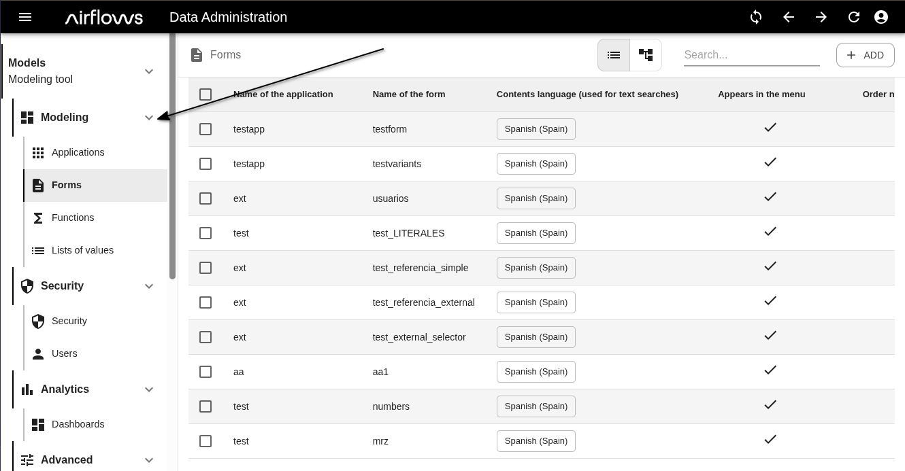
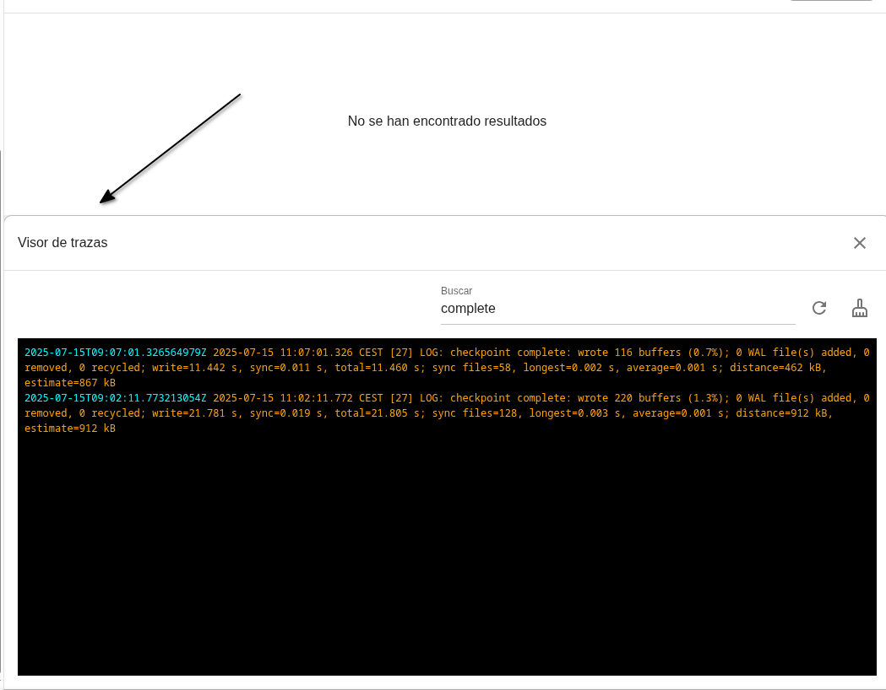
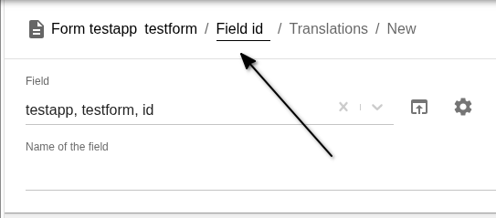
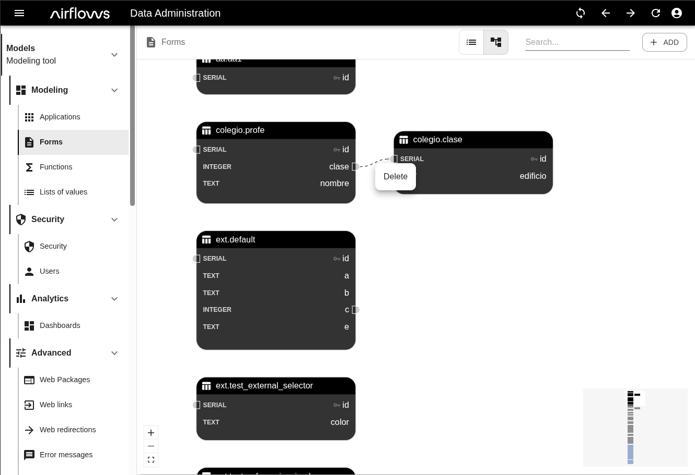
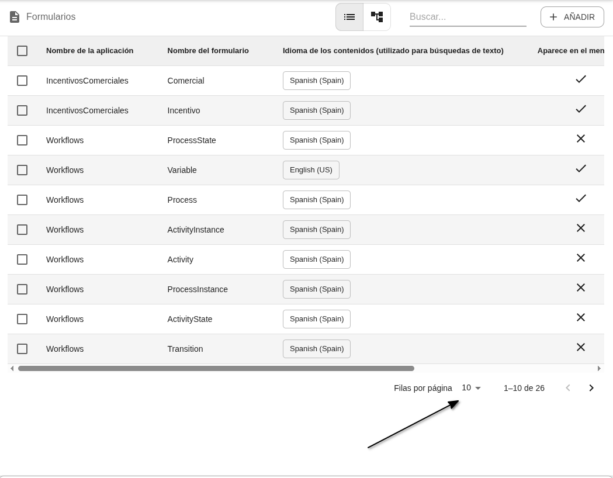
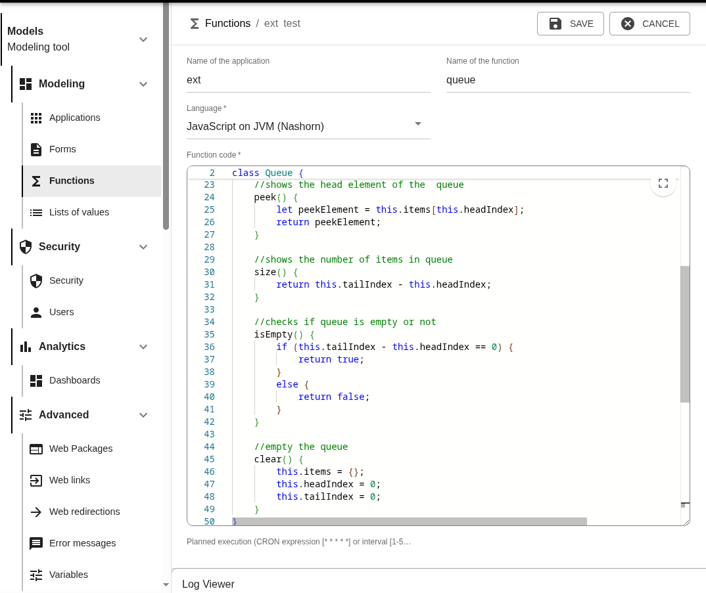

# 🔧 Mejoras frontal Airflows v2.0

## Generales
- Se ha rediseñado el menú con subniveles plegables para una navegación más sencilla. Inicialmente todos los submenús están cerrados y, una vez que el usuario los abre o cierra, la aplicación recuerda su preferencia para las próximas sesiones.

- Cambios visuales en el *Visor de logs* para mejorar su usabilidad

- Se añaden migas de pan navegables en los títulos las páginas dentro de una jerarquía

## Listados de *Formularios*
- En la vista de diagramas, se ha actualizado el aspecto visual de los diagramas y se ha incluido la funcionalidad de eliminar relación

- Se ha mejorado la interfaz para navegar entre páginas del listado y el rendimiento visual de las tablas

## Vista / creación / edición de *Formularios*
- Mejorado el rendimiento de la interfaz de los formularios para crear y actualizar *Formularios* (y mejoras visuales en la representación del campo mapa y del campo color)
- Interfaz de edición de *Funciones* mejorada, con resaltado de sintaxis y autocompletado en los tres lenguajes de programación disponibles en la plataforma

- La barra superior de acciones permanece visible al hacer scroll, facilitando la operativa sobre formularios con muchos campos
- A la hora de crear un nuevo *Campo* en un *Formulario*, solo se muestran los parámetros disponibles para el tipo de campo seleccionado.  