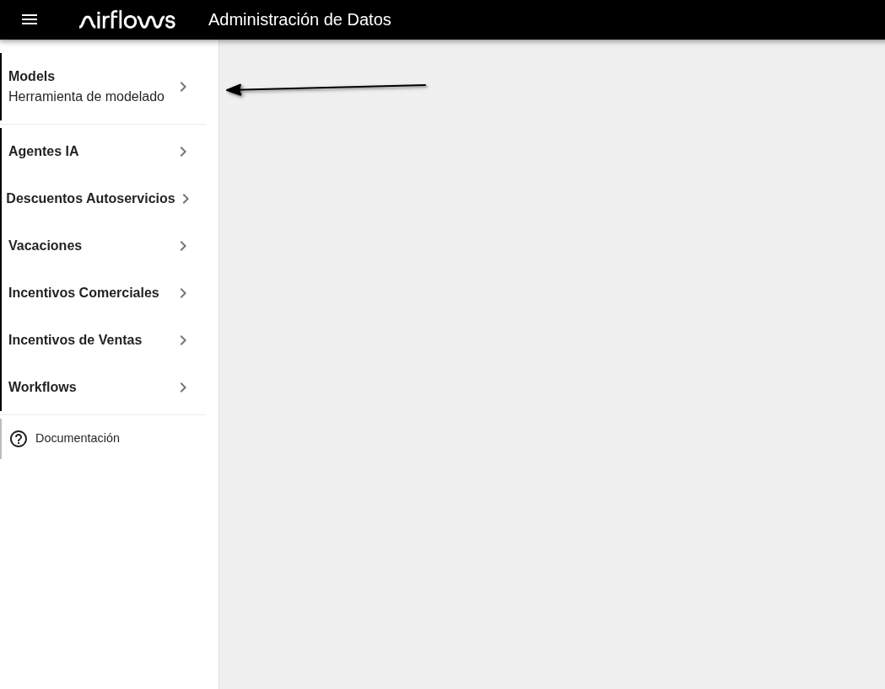
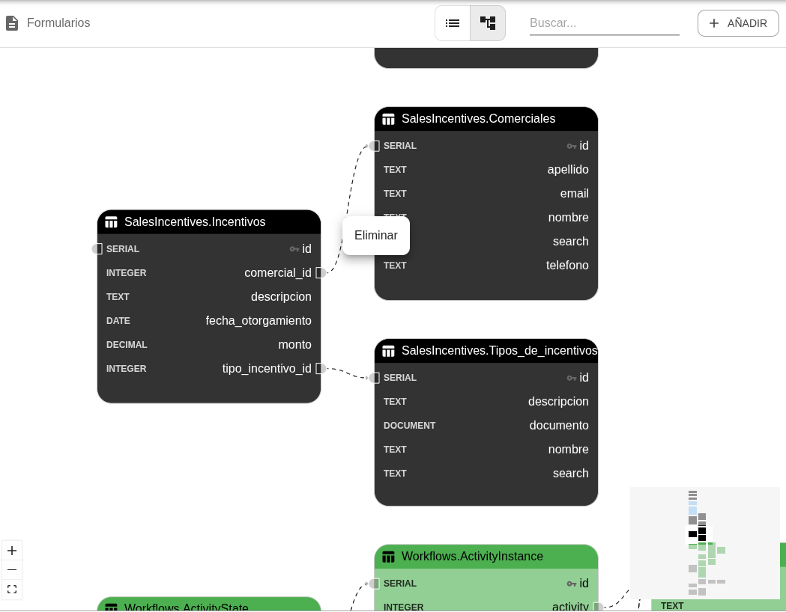
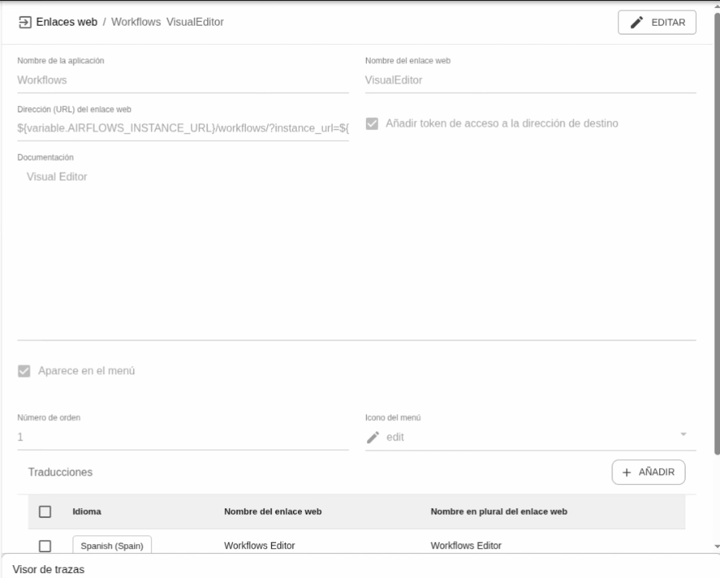
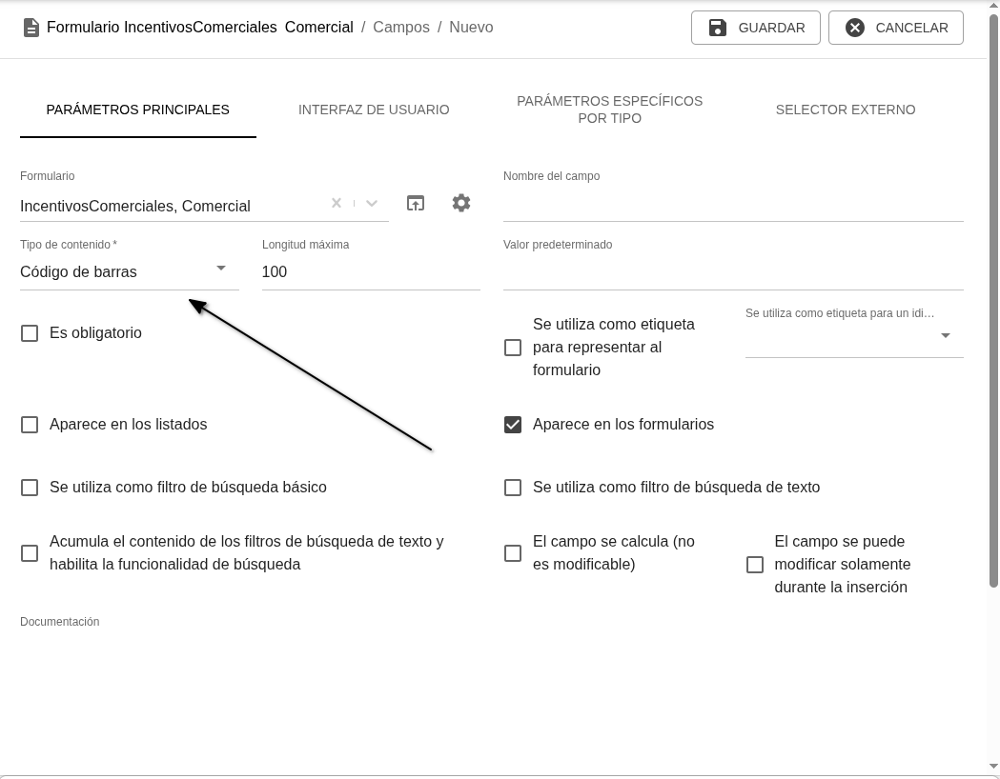

# 🔧 Mejoras frontal Airflows v2.0

- [🔧 Mejoras frontal Airflows v2.0](#-mejoras-frontal-airflows-v20)
  - [Generales](#generales)
  - [Listados de *Formularios*](#listados-de-formularios)
  - [Vista / creación / edición de *Formularios*](#vista--creación--edición-de-formularios)

## Generales
- Se ha rediseñado el menú con subniveles plegables para una navegación más sencilla. Inicialmente todos los submenús están cerrados y, una vez que el usuario los abre o cierra, la aplicación recuerda su preferencia para las próximas sesiones.

- Cambios visuales en el *Visor de trazas* para mejorar su usabilidad

- Se añaden migas de pan navegables en los títulos las páginas dentro de una jerarquía

## Listados de *Formularios*
- En la vista de diagramas, se ha actualizado el aspecto visual de los diagramas y se ha incluido nuevas funcionalidades: 
  - Ahora se puede eliminar una relación seleccionando la línea de relación y haciendo click en "Eliminar"
  - En la parte inferior derecha se muestra un mapa en miniatura del diagrama para facilitar la navegación

- Se ha mejorado la interfaz para navegar entre páginas del listado y el rendimiento visual de las tablas

## Vista / creación / edición de *Formularios*
- Mejorado el rendimiento de la interfaz de los formularios para crear y actualizar *Formularios* (y mejoras visuales en la representación del campo mapa y del campo color)
- Interfaz de edición de *Funciones* mejorada, con resaltado de sintaxis y autocompletado en los tres lenguajes de programación disponibles en la plataforma

- La barra superior de acciones permanece visible al hacer scroll, facilitando la operativa sobre formularios con muchos campos

- A la hora de crear un nuevo *Campo* en un *Formulario*, solo se muestran los parámetros disponibles para el tipo de campo seleccionado.  

