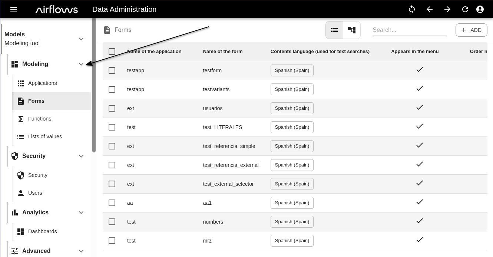
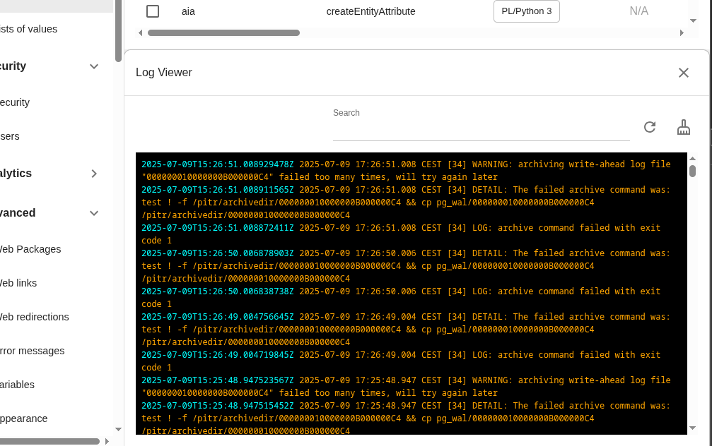
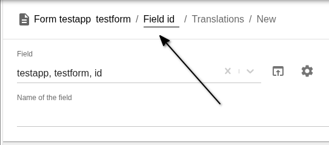
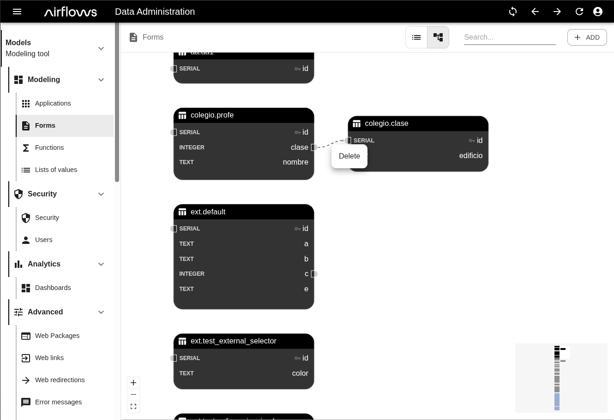
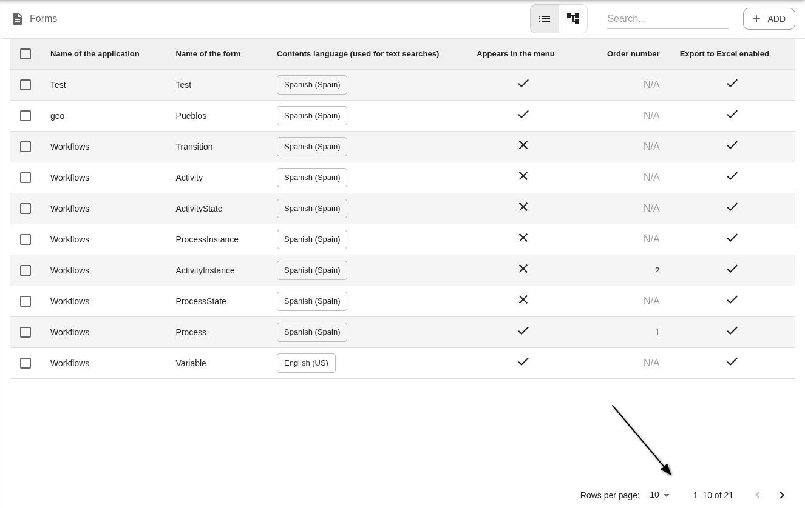
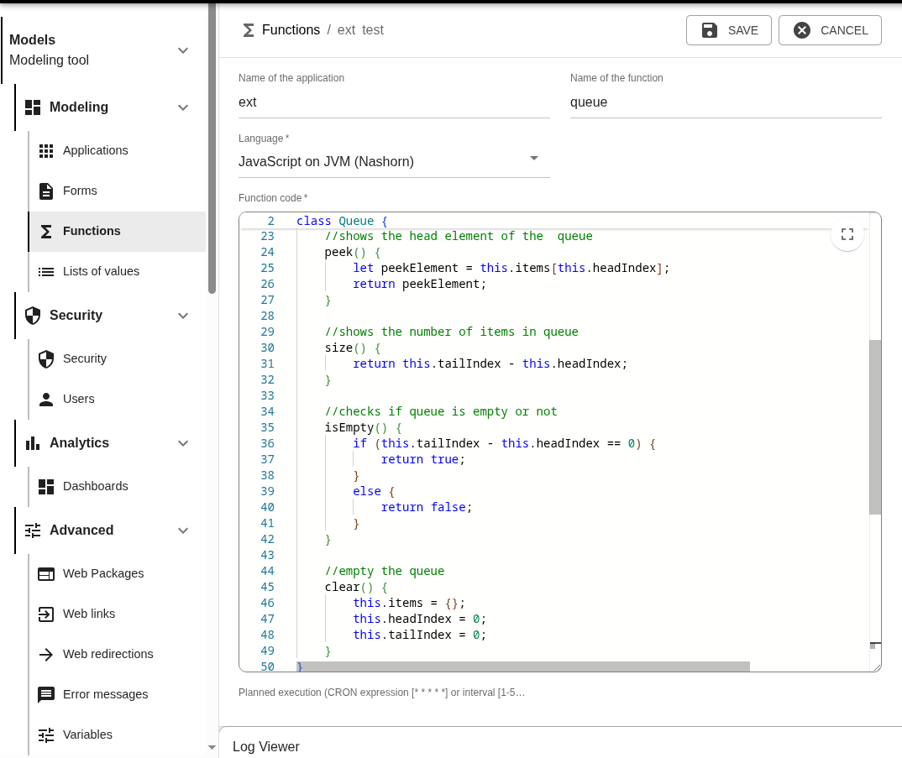

# Mejoras frontal Airflows v2.0

## Generales
- Cambios en el layout: menú con subniveles plegables para facilitar la navegación

- Cambios visuales en el *Visor de logs* para mejorar su usabilidad

- Se añaden migas de pan navegables en los títulos las páginas dentro de una jerarquía

## Listados de *Entidades*
- En la vista de diagramas, se ha actualizado el aspecto visual de los diagramas y se ha incluido la funcionalidad de eliminar relación

- Virtualización y otras mejoras en el rendimiento de las tablas
- Se ha mejorado la interfaz para navegar entre páginas del listado

## Vista / creación / edición de *Entidades*
- Mejorado el rendimiento de la interfaz de los formularios para crear y actualizar *Entidades* (y mejoras visuales en la representación del campo mapa y del campo color)
- Interfaz de edición de *Funciones* mejorada, con resaltado de sintaxis y autocompletado en los tres lenguajes de programación disponibles en la plataforma

