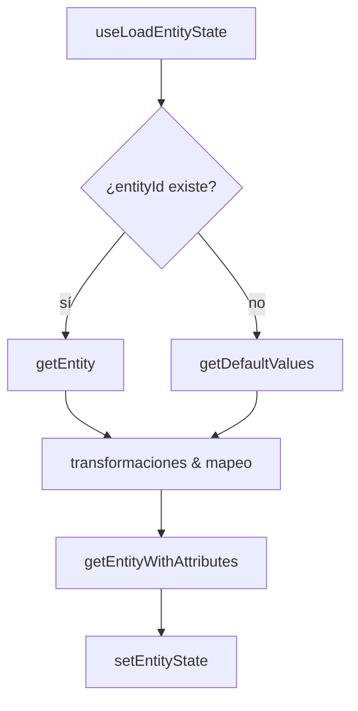

# Carga de datos de una entidad (`useLoadEntityState`)

## Introducción
Este documento describe de forma resumida cómo el front-end carga la información necesaria para mostrar y editar una entidad utilizando el _hook_ `useLoadEntityState`. Se detallan las llamadas al back-end, las transformaciones en el cliente y dónde se almacenan los datos resultantes.

## Flujo de llamadas al back-end
1. **`getEntity`**  
   Recupera un registro existente cuando `entityId` está definido. Construye dinámicamente una consulta GraphQL con filtro `where` sobre la clave primaria.

2. **`getDefaultValues`**  
   Solo para nuevas inserciones. Devuelve los valores por defecto definidos en el modelo local (`localModel`).

3. **`getEntityWithAttributes`**  
   Se invoca para resolver atributos de referencia y obtener etiquetas (labels) adicionales. Puede llamarse varias veces durante la preparación del estado.

Todas las peticiones viajan por `graphqlQueryRaw`, que añade la cabecera `Authorization` con el _access token_ obtenido de `useAuth`. La caché de **React Query** evita solicitudes redundantes.

## Transformaciones en el cliente
1. **Mapeo y enriquecimiento de atributos**  
   `mapAttributes` fusiona la definición de la base de datos con el modelo local para añadir propiedades de UI (orden, reglas, tipo de entrada, etc.).

2. **Generación de la selección GraphQL**  
   `mapAttributesToQuery` produce los fragmentos necesarios para recuperar sub-campos de referencias y labels.

3. **Valores iniciales**  
   * Nuevos registros: valores por defecto (incluido `now()` formateado) y booleanos inicializados a `false`.
   * Registros existentes: los valores llegan directamente del back-end; `updateUploadedData` extrae la información de ficheros (`DOCUMENT`).

4. **Timestamps de sesión**  
   `updateTimestamps` lee `startTimestamp` y `endTimestamp` de `AppState` y los copia en los atributos correspondientes (`eventStart`, `eventEnd`).

5. **Gestión de variantes**  
   `getSelectedVariants` calcula las variantes activas y elimina aquellas ocultas.

6. **Parámetros en filtros**  
   `processParameters` sustituye expresiones `$param` dentro de `additionalFilter` por valores presentes en los datos de la entidad.

## Almacenamiento de resultados
* **Estado del componente**: `entityState` mantiene `data`, `attributes`, `variants`, `uploadedData`, etc.
* **React Query**: cachea las respuestas de GraphQL.
* **Contexto global (`AppStateContext`)**: conserva información transversal como los timestamps de proceso y el modelo.

## Diagrama de flujo

## Conclusiones
El proceso combina tres fuentes: modelo local, datos del back-end y estado de sesión. Las transformaciones intermedias garantizan que el formulario reciba únicamente los campos visibles, con valores iniciales ya resueltos y listos para su visualización o edición. 