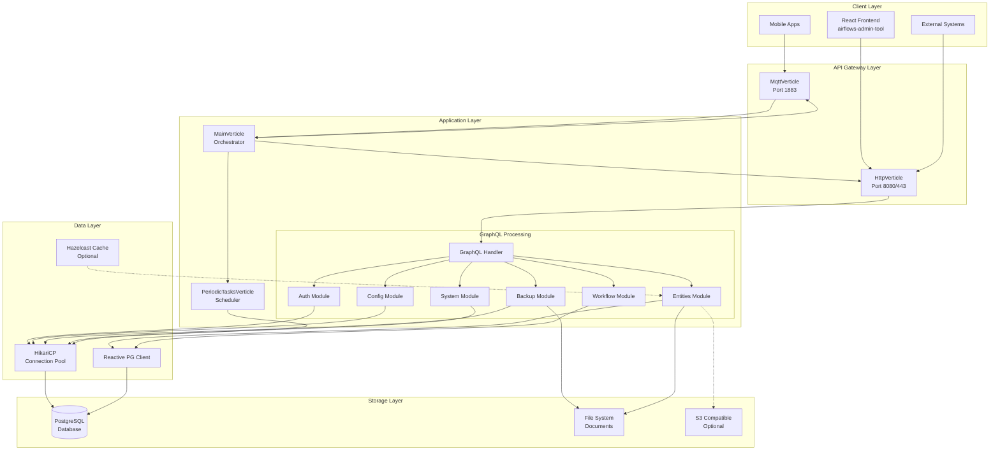
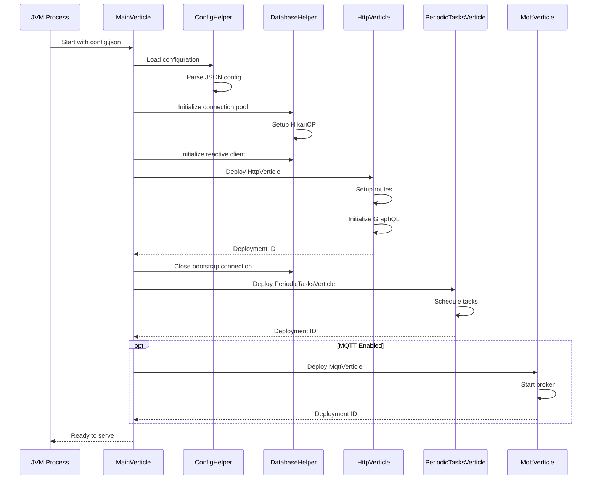
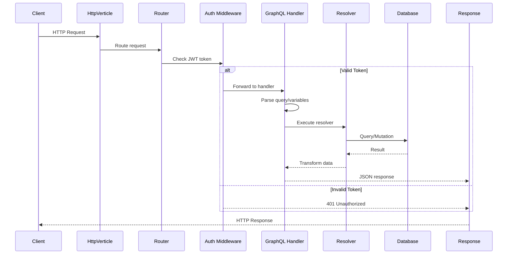
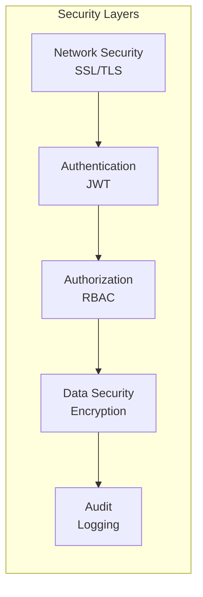
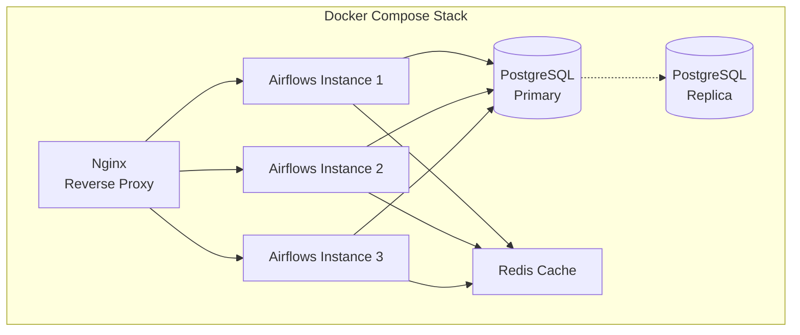

# System architecture

## Overview

Airflows-uno is the backend core of the Airflows platform, designed as a reactive, event-driven system built on Java and Vert.x framework. It provides a comprehensive GraphQL API for business process management, data operations, and workflow orchestration.

## High-level architecture diagram



## Component interaction flow

### Startup sequence



### Request processing flow



## Technology stack justification

### Core technologies

| Technology | Version | Justification |
|------------|---------|--------------|
| **Java** | 11+ | • Mature ecosystem<br/>• Strong typing<br/>• Enterprise-grade performance<br/>• Excellent tooling support |
| **Vert.x** | 5.0.1 | • Reactive programming model<br/>• Non-blocking I/O<br/>• Event-driven architecture<br/>• Polyglot support<br/>• Built-in clustering |
| **GraphQL Java** | 24.1 | • Flexible query language<br/>• Single endpoint API<br/>• Strong typing<br/>• Self-documenting<br/>• Efficient data fetching |
| **PostgreSQL** | 15+ | • ACID compliance<br/>• JSON/JSONB support<br/>• Row-level security<br/>• Excellent performance<br/>• Extensibility |

### Supporting libraries

| Library | Purpose | Benefits |
|---------|---------|----------|
| **HikariCP** | Connection pooling | • Fastest connection pool<br/>• Low latency<br/>• Production tested |
| **Nimbus JOSE** | JWT handling | • Standards compliant<br/>• Secure by default<br/>• Wide algorithm support |
| **Logback** | Logging | • High performance<br/>• Flexible configuration<br/>• SLF4J integration |
| **Micrometer** | Metrics | • Vendor-neutral<br/>• Multiple backends<br/>• JVM metrics included |
| **Hazelcast** | Distributed cache | • In-memory speed<br/>• Clustering support<br/>• Auto-discovery |

## Design patterns used

### 1. Verticle pattern (microservices)

The application is decomposed into independent verticles, each responsible for a specific domain:

```java
// Example: MainVerticle orchestrates other verticles
public class MainVerticle extends AbstractVerticle {
    @Override
    public void start(Promise<Void> promise) {
        // Deploy child verticles in sequence
        vertx.deployVerticle(HttpVerticle::new, options)
            .compose(id -> vertx.deployVerticle(PeriodicTasksVerticle.class))
            .compose(id -> deployMqttIfEnabled())
            .onSuccess(id -> promise.complete())
            .onFailure(promise::fail);
    }
}
```

**Benefits:**
- Isolation of concerns
- Independent scaling
- Fault tolerance
- Clear boundaries

### 2. Reactive pattern

All I/O operations use non-blocking, reactive patterns:

```java
// Reactive database query example
public Future<JsonArray> executeQuery(String sql) {
    return client
        .preparedQuery(sql)
        .execute()
        .map(rows -> {
            JsonArray result = new JsonArray();
            rows.forEach(row -> result.add(row.toJson()));
            return result;
        });
}
```

**Benefits:**
- High concurrency
- Resource efficiency
- Backpressure handling
- Composable operations

### 3. Dynamic schema generation

GraphQL schema is generated dynamically from the data model:

```java
// Schema built from database model
public class SchemaModule {
    public static GraphQLSchema buildSchema(JsonObject model) {
        GraphQLSchema.Builder schemaBuilder = GraphQLSchema.newSchema();
        
        // Dynamically add types from model
        model.getJsonArray("entities").forEach(entity -> {
            GraphQLObjectType entityType = buildEntityType(entity);
            schemaBuilder.additionalType(entityType);
        });
        
        return schemaBuilder.build();
    }
}
```

**Benefits:**
- Single source of truth
- No code generation needed
- Runtime flexibility
- Automatic API updates

### 4. Repository pattern

Data access is abstracted through repository classes:

```java
public class EntityRepository {
    private final DatabaseHelper db;
    
    public Future<JsonObject> findById(String entity, String id) {
        return db.executeQuery(
            "SELECT * FROM " + entity + " WHERE id = $1",
            Tuple.of(id)
        );
    }
    
    public Future<String> create(String entity, JsonObject data) {
        return db.executeInsert(entity, data);
    }
}
```

**Benefits:**
- Separation of concerns
- Testability
- Consistent data access
- Easy to mock

### 5. Builder pattern

Complex objects are constructed using builders:

```java
GraphQLFieldDefinition field = GraphQLFieldDefinition.newFieldDefinition()
    .name("users")
    .type(GraphQLList.list(userType))
    .argument(GraphQLArgument.newArgument()
        .name("filter")
        .type(GraphQLString)
        .build())
    .dataFetcher(usersFetcher)
    .build();
```

**Benefits:**
- Fluent API
- Optional parameters
- Immutable objects
- Clear construction

### 6. Strategy pattern

Different execution strategies based on operation type:

```java
public class OperationExecutor {
    private final Map<OperationType, ExecutionStrategy> strategies;
    
    public Future<JsonObject> execute(Operation op) {
        ExecutionStrategy strategy = strategies.get(op.getType());
        return strategy.execute(op);
    }
}
```

**Benefits:**
- Extensibility
- Open/closed principle
- Runtime selection
- Clean separation

### 7. Event bus pattern

Inter-verticle communication via event bus:

```java
// Publisher
vertx.eventBus().publish("model.updated", modelJson);

// Subscriber
vertx.eventBus().consumer("model.updated", message -> {
    refreshSchema(message.body());
});
```

**Benefits:**
- Loose coupling
- Async messaging
- Location transparency
- Pub/sub support

### 8. Circuit breaker pattern

Protection against cascading failures:

```java
CircuitBreaker breaker = CircuitBreaker.create("db-breaker", vertx,
    new CircuitBreakerOptions()
        .setMaxFailures(5)
        .setTimeout(5000)
        .setResetTimeout(10000)
);

breaker.execute(promise -> {
    database.query(sql, promise);
}).onSuccess(result -> {
    // Process result
}).onFailure(cause -> {
    // Handle circuit open
});
```

**Benefits:**
- Fault tolerance
- Fast failure
- Automatic recovery
- System stability

## Scalability considerations

### Vertical scaling
- JVM heap size configuration
- Thread pool tuning
- Connection pool sizing
- Worker pool optimization

### Horizontal scaling
- Stateless design allows multiple instances
- Hazelcast for distributed caching
- PostgreSQL handles concurrent connections
- Load balancer ready

### Performance optimizations
- Non-blocking I/O throughout
- Connection pooling
- Prepared statements
- Result streaming for large datasets
- Lazy loading where appropriate

## Security architecture

### Defense in depth



### Security patterns
- JWT-based stateless authentication
- Role-based access control (RBAC)
- Row-level security in PostgreSQL
- Prepared statements prevent SQL injection
- Input validation and sanitization
- Secure password hashing (BCrypt)
- HTTPS enforcement in production

## Deployment architecture

### Container-based deployment



### Production considerations
- Health check endpoints for orchestrators
- Graceful shutdown handling
- Rolling updates support
- Configuration via environment variables
- Centralized logging
- Metrics exposure for monitoring

## Next steps

This architecture provides the foundation for understanding the Airflows backend. For deeper dives into specific components:

1. [Core concepts](./2-core-concepts.md) - Detailed explanation of Vert.x concepts
2. [GraphQL implementation](./3-graphql-layer.md) - How the GraphQL layer works
3. [Database design](./4-database-layer.md) - Schema and migration details
4. [Security implementation](./5-security.md) - Authentication and authorization details


