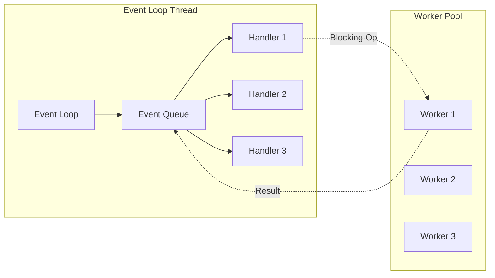
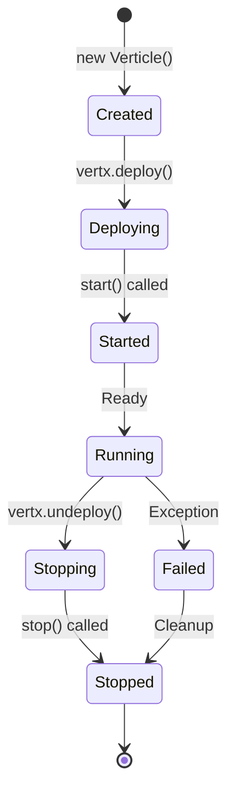
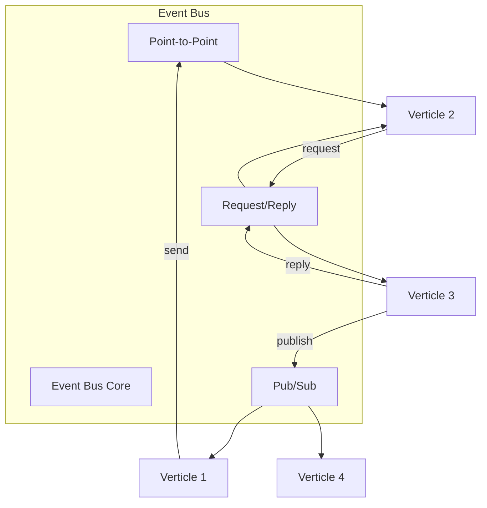
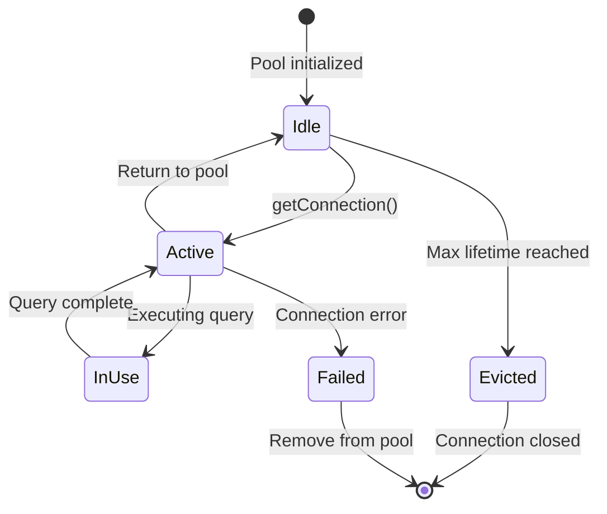
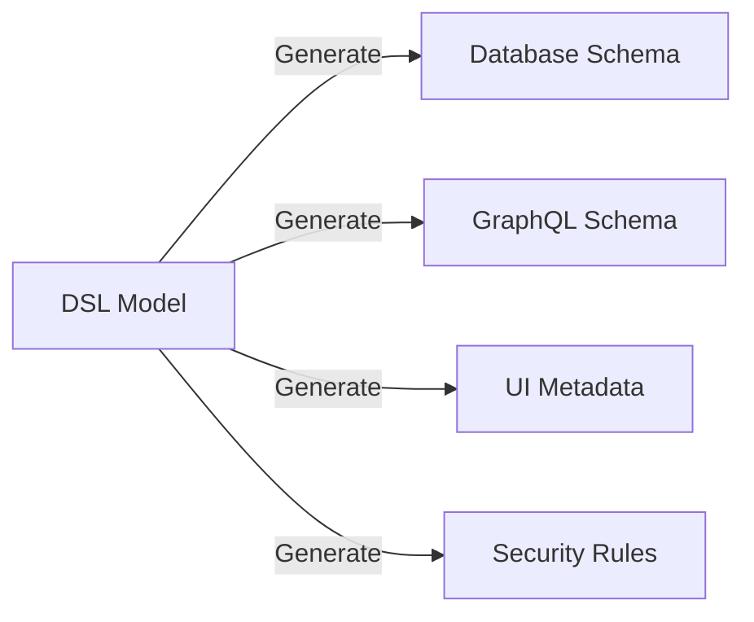
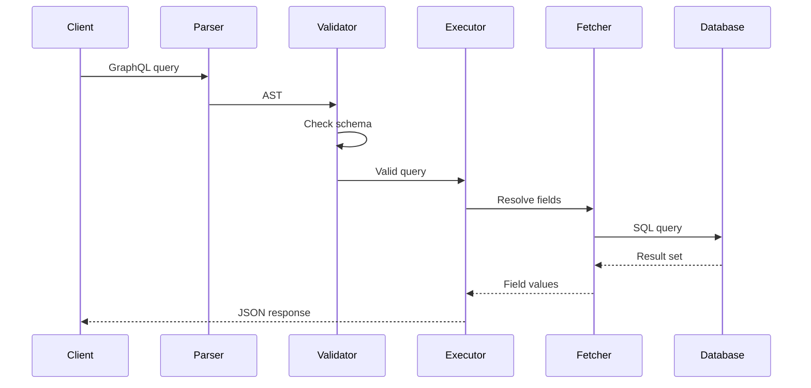
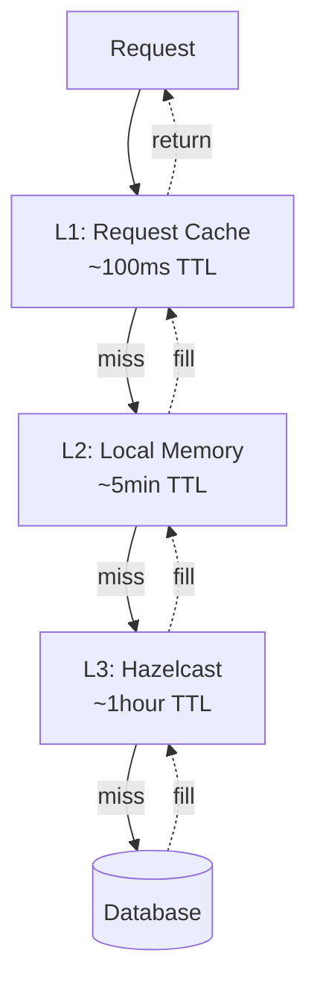

# Core concepts

## Introduction

Understanding the core concepts of Airflows backend is essential for effective development and troubleshooting. This document explains the fundamental principles and patterns that drive the architecture.

## Reactive programming model

### What is reactive programming?

Reactive programming is a paradigm focused on asynchronous data streams and the propagation of change. In Airflows, this means:

- **Non-blocking I/O**: Operations don't block threads while waiting for results
- **Event-driven**: Components react to events rather than polling
- **Backpressure**: Automatic flow control when consumers can't keep up
- **Composable**: Operations can be chained and combined

### Vert.x event loop



**Key principles:**
1. Event loops should never be blocked
2. Blocking operations run on worker threads
3. Results return to event loop via callbacks
4. One event loop per CPU core (default)

### Future and promise pattern

```java
// Creating a Future
public Future<String> fetchUserName(String userId) {
    Promise<String> promise = Promise.promise();
    
    // Async operation
    database.query("SELECT name FROM users WHERE id = ?", userId)
        .onSuccess(rows -> {
            if (rows.size() > 0) {
                promise.complete(rows.iterator().next().getString("name"));
            } else {
                promise.fail("User not found");
            }
        })
        .onFailure(promise::fail);
    
    return promise.future();
}

// Composing Futures
public Future<JsonObject> getUserWithRoles(String userId) {
    return fetchUserName(userId)
        .compose(name -> fetchUserRoles(userId)
            .map(roles -> new JsonObject()
                .put("name", name)
                .put("roles", roles)
            )
        );
}
```

## Verticle architecture

### What is a verticle?

A verticle is the fundamental deployment unit in Vert.x, similar to:
- An actor in the Actor Model
- A microservice in a microservices architecture
- A servlet in traditional Java web apps

### Verticle lifecycle



### Verticle types in Airflows

| Type | Purpose | Characteristics |
|------|---------|-----------------|
| **Standard Verticle** | General purpose | Runs on event loop |
| **Worker Verticle** | Blocking operations | Runs on worker thread |
| **Multi-threaded Worker** | Concurrent blocking ops | Multiple instances share state |

### Inter-verticle communication

```java
// Event Bus - Publish/Subscribe
public class NotificationVerticle extends AbstractVerticle {
    @Override
    public void start() {
        // Subscribe to events
        vertx.eventBus().consumer("user.created", message -> {
            JsonObject user = (JsonObject) message.body();
            sendWelcomeEmail(user);
        });
    }
}

// Request/Reply pattern
public class DataVerticle extends AbstractVerticle {
    @Override
    public void start() {
        vertx.eventBus().consumer("data.fetch", message -> {
            String query = (String) message.body();
            fetchData(query)
                .onSuccess(message::reply)
                .onFailure(err -> message.fail(500, err.getMessage()));
        });
    }
}
```

## Event-driven messaging

### Event bus architecture



### Message types

1. **Send**: Point-to-point to one consumer
2. **Publish**: Broadcast to all consumers
3. **Request**: Send and expect reply
4. **Local**: Same JVM only
5. **Clustered**: Across multiple JVMs

## Connection pooling strategy

### HikariCP configuration

```java
// Optimal pool configuration
HikariConfig config = new HikariConfig();
config.setJdbcUrl("jdbc:postgresql://localhost:5432/airflows");
config.setUsername("postgres");
config.setPassword("password");

// Pool sizing formula: connections = ((core_count * 2) + effective_spindle_count)
int cores = Runtime.getRuntime().availableProcessors();
config.setMaximumPoolSize(cores * 2 + 1);
config.setMinimumIdle(cores);

// Timeouts
config.setConnectionTimeout(30000); // 30 seconds
config.setIdleTimeout(600000); // 10 minutes
config.setMaxLifetime(1800000); // 30 minutes

// Performance
config.setAutoCommit(false);
config.addDataSourceProperty("cachePrepStmts", "true");
config.addDataSourceProperty("prepStmtCacheSize", "250");
config.addDataSourceProperty("prepStmtCacheSqlLimit", "2048");
```

### Connection lifecycle



## DSL-driven development

### Model as code

The Domain Specific Language (DSL) defines:

```json
{
  "model": {
    "entities": [
      {
        "name": "User",
        "attributes": [
          {
            "name": "email",
            "type": "TEXT",
            "required": true,
            "unique": true
          },
          {
            "name": "roles",
            "type": "Role",
            "array": true,
            "reference": true
          }
        ]
      }
    ],
    "roles": [
      {
        "name": "admin",
        "permissions": [
          {
            "entity": "User",
            "operations": ["SELECT", "INSERT", "UPDATE", "DELETE"]
          }
        ]
      }
    ]
  }
}
```

### DSL transformation pipeline



## GraphQL execution model

### Query execution flow



### DataFetcher pattern

```java
public class UserFetcher implements DataFetcher<CompletableFuture<User>> {
    @Override
    public CompletableFuture<User> get(DataFetchingEnvironment env) {
        String userId = env.getArgument("id");
        GraphQLContext context = env.getGraphQlContext();
        
        return context.get("dataLoader")
            .load(userId)
            .toCompletableFuture();
    }
}
```

## Caching strategies

### Multi-level cache



### Cache invalidation

```java
// Event-driven cache invalidation
vertx.eventBus().consumer("entity.updated", message -> {
    JsonObject entity = (JsonObject) message.body();
    String entityType = entity.getString("type");
    String entityId = entity.getString("id");
    
    // Invalidate all cache levels
    requestCache.remove(entityId);
    localCache.remove(entityId);
    hazelcast.getMap(entityType).remove(entityId);
    
    // Notify other nodes in cluster
    vertx.eventBus().publish("cache.invalidate", entity);
});
```

## Error handling patterns

### Resilience strategies

1. **Retry with exponential backoff**
```java
public Future<T> retryWithBackoff(Supplier<Future<T>> operation, int maxRetries) {
    return operation.get()
        .recover(error -> {
            if (maxRetries > 0) {
                int delay = (int) Math.pow(2, 3 - maxRetries) * 1000;
                return Future.future(promise ->
                    vertx.setTimer(delay, id ->
                        retryWithBackoff(operation, maxRetries - 1)
                            .onComplete(promise)
                    )
                );
            }
            return Future.failedFuture(error);
        });
}
```

2. **Circuit breaker**
```java
CircuitBreaker breaker = CircuitBreaker.create("db-breaker", vertx,
    new CircuitBreakerOptions()
        .setMaxFailures(5)
        .setTimeout(5000)
        .setFallbackOnFailure(true)
);

breaker.executeWithFallback(
    promise -> database.query(sql, promise),
    v -> getCachedResult() // Fallback
);
```

3. **Bulkhead pattern**
```java
// Isolate resources for different operations
WorkerExecutor criticalOps = vertx.createSharedWorkerExecutor("critical", 10);
WorkerExecutor bulkOps = vertx.createSharedWorkerExecutor("bulk", 5);

// Critical operations get dedicated resources
criticalOps.executeBlocking(promise -> {
    // Important operation
});

// Bulk operations can't starve critical ones
bulkOps.executeBlocking(promise -> {
    // Bulk operation
});
```

## Monitoring and observability

### Key metrics

| Metric | Purpose | Alert threshold |
|--------|---------|-----------------|
| Event loop blocked | Detect blocking operations | > 1 second |
| Connection pool usage | Database pressure | > 80% |
| Response time P99 | User experience | > 2 seconds |
| Error rate | System health | > 1% |
| GC pause time | JVM health | > 500ms |

### Health checks

```java
HealthCheckHandler health = HealthCheckHandler.create(vertx);

// Database health
health.register("database", promise -> {
    database.query("SELECT 1")
        .onSuccess(v -> promise.complete(Status.OK()))
        .onFailure(err -> promise.complete(Status.KO()));
});

// Memory health
health.register("memory", promise -> {
    long used = Runtime.getRuntime().totalMemory() - Runtime.getRuntime().freeMemory();
    long max = Runtime.getRuntime().maxMemory();
    double usage = (double) used / max;
    
    if (usage < 0.9) {
        promise.complete(Status.OK());
    } else {
        promise.complete(Status.KO());
    }
});
```

## Best practices

### Do's
- ✅ Keep event loop handlers short and non-blocking
- ✅ Use Futures for async composition
- ✅ Configure appropriate connection pool sizes
- ✅ Implement circuit breakers for external calls
- ✅ Use prepared statements for SQL queries
- ✅ Monitor event loop blocked warnings
- ✅ Implement proper error handling
- ✅ Use structured logging

### Don'ts
- ❌ Block the event loop thread
- ❌ Use Thread.sleep() in handlers
- ❌ Ignore Future failures
- ❌ Create connections per request
- ❌ Use synchronous I/O in verticles
- ❌ Share mutable state between verticles
- ❌ Catch and suppress exceptions silently

## Further reading

- [Vert.x Documentation](https://vertx.io/docs/)
- [Reactive Manifesto](https://www.reactivemanifesto.org/)
- [GraphQL Best Practices](https://graphql.org/learn/best-practices/)
- [HikariCP Configuration](https://github.com/brettwooldridge/HikariCP#configuration)

## Next: [GraphQL implementation](./3-graphql-layer.md)


