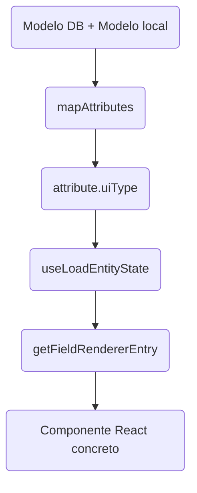

# uiType
Cálculo y utilización del tipo de atributo (`uiType`) en el *Entity View*

## Índice
1. Visión general del flujo de datos
2. Paso 1 – `mapAttributes.ts`: enriquecimiento y fijación de `uiType`
3. Paso 2 – `getUiType.ts`: algoritmo de clasificación
4. Paso 3 – `useLoadEntityState.ts`: cómo llega el `uiType` al estado de la entidad
5. Paso 4 – `getFieldRendererEntry.tsx`: selección del componente React
6. Tabla resumen `uiType → FieldRenderer`
7. Puntos de extensión y consideraciones

---

## 1. Visión general del flujo de datos

* **Modelo DB:** describe la estructura real de la tabla (tipo, longitud, PK …).
* **Modelo local:** añade metadatos puramente de presentación (visibilidad, color, iconos …).
* `mapAttributes` fusiona ambas fuentes y decide un `uiType` por atributo.
* `useLoadEntityState` guarda la lista de atributos (con su `uiType`) en el estado global del formulario.
* `getFieldRendererEntry` traduce cada `uiType` a un componente React específico para el renderizado.

---

## 2. Paso 1 – `mapAttributes.ts`

Archivo: `src/components/entity-view/hooks/useLoadEntityState/mapAttributes.ts`

Responsabilidades principales:

* Combinar atributos del modelo DB (`dbAttributes`) con el modelo local (`localAttributes`).
* Propagar al objeto resultado propiedades visuales: `hidden`, `rich`, `icon`, etc.
* Invocar `getUiType(attribute, localAttribute)` y **persistir** el valor resultante en `attribute.uiType`.
* Detectar campos que actúan como selectores de variantes (`variantSelector`) y devolverlos aparte.

Resultado: colección de `DBAttributeDefinition` enriquecidos que incluye `uiType` y está lista para las siguientes fases del pipeline.

---

## 3. Paso 2 – `getUiType.ts`

Archivo: `src/components/entity-view/util/getUiType.ts`

Algoritmo basado en reglas secuenciales y mutuamente excluyentes. Se evalúa de arriba abajo; la primera coincidencia detiene el proceso.

| Nº | Condición (simplificada) | `uiType` generado |
|----|--------------------------|-------------------|
| 1 | `localAttribute.type === 'SIGNATURE'` | `SIGNATURE` |
| 2 | `localAttribute.type === 'DOCUMENT'` y **no** es array | `DOCUMENT` |
| 3 | `localAttribute.type === 'BARCODE'` | `BARCODE` |
| 4 | `localAttribute.action` \|\| `actionVisibleInForm` | `ACTION` |
| 5 | Texto simple (ni array ni rico, sin password, sin color, sin icono) | `TEXT` |
| 6 | Flag `password` activado | `TEXT_PASSWORD` |
| 7 | Flag `color` activado | `COLOR` |
| 8 | Flag `rich` activado | `RICH_TEXT` |
| 9 | Enum + flag `icon` | `ICON` |
| 10 | Enum sin icono | `ENUM` |
| 11 | Tipo `BOOLEAN` | `BOOLEAN` |
| 12 | Tipo numérico (`INT`, `DECIMAL`, etc.) | `NUMBER` |
| 13 | Tipo `DATE` | `DATE` |
| 14 | Tipo `TIMESTAMP[ _WITH_TIME_ZONE]` | `TIMESTAMP` |
| 15 | Tipo `TIME[ _WITH_TIME_ZONE]` | `TIME` |
| 16 | Array de texto | `TEXT_ARRAY` |
| 17 | Tipo espacial `POINT` | `POINT` |
| — | (ninguna coincide) | `NOT_SUPPORTED` |

### Notas de diseño
* Se usan flags auxiliares `isPassword`, `isColor`, `isIcon`, `isRich` para legibilidad.
* La lógica queda centralizada evitando repetir condicionales complejos en cada formulario.

---

## 4. Paso 3 – `useLoadEntityState.ts`

Archivo: `src/components/entity-view/hooks/useLoadEntityState/useLoadEntityState.ts`

1. Llama a `mapAttributes` y obtiene la lista con `uiType` ya resuelto.
2. Aplica filtros de visibilidad, orden y autofocus pero **no** altera `uiType`.
3. Inserta la lista en `newState.attributes` y publica el estado con `setEntityState`.

De esta forma, cualquier componente descendiente puede acceder a `attribute.uiType` para decidir su renderizado.

---

## 5. Paso 4 – `getFieldRendererEntry.tsx`

Archivo: `src/components/entity-view/entity-field/getFieldRendererEntry.tsx`

Proceso de resolución:

1. Recibe `attribute` y extrae `attribute.uiType`.
2. Busca el valor en `rendererMap` (`uiType → RendererEntry`).
3. Devuelve un objeto con:
   * `renderer`: componente React (p.ej. `TextField`, `EnumField`…)
   * Metadatos adicionales (`type="password"`, `autoComplete="new-password"`, etc.)
4. Si el `uiType` no está registrado, retorna `null` ↔ campo no soportado.

---

## 6. Tabla resumen `uiType → FieldRenderer`

| `uiType` | Componente React | Props adicionales fijas |
|----------|-----------------|--------------------------|
| `SIGNATURE` | `SignatureField` | — |
| `DOCUMENT` | `DocumentField` | — |
| `BARCODE` | `BarcodeField` | — |
| `ACTION` | `ActionField` | — |
| `TEXT` | `TextField` | — |
| `TEXT_PASSWORD` | `TextField` | `type="password"` |
| `COLOR` | `ColorSelectorField` | — |
| `RICH_TEXT` | `RichTextField` | — |
| `ICON` | `IconField` | — |
| `ENUM` | `EnumField` | — |
| `BOOLEAN` | `BooleanField` | — |
| `NUMBER` | `TextField` | `type="number"` |
| `DATE` | `TextField` | `type="date"` |
| `TIMESTAMP` | `TextField` | `type="datetime-local"` |
| `TIME` | `TextField` | — |
| `TEXT_ARRAY` | `TextMultipleField` | — |
| `POINT` | `PointField` | — |

---

## 7. Puntos de extensión y buenas prácticas

* **Añadir un nuevo tipo**
  1. Crear el componente React (`XField`).
  2. Incorporar su detección en `getUiType.ts`.
  3. Registrar el `uiType` en `getFieldRendererEntry.tsx`.

* **Fallback `NOT_SUPPORTED`**
  Permite loggear y detectar atributos sin soporte, evitando fallos de renderizado.

* **Cohesión front–back**
  `uiType` es una convención del cliente; si el back-end agrega lógica relacionada, mantener la paridad para evitar inconsistencias. 