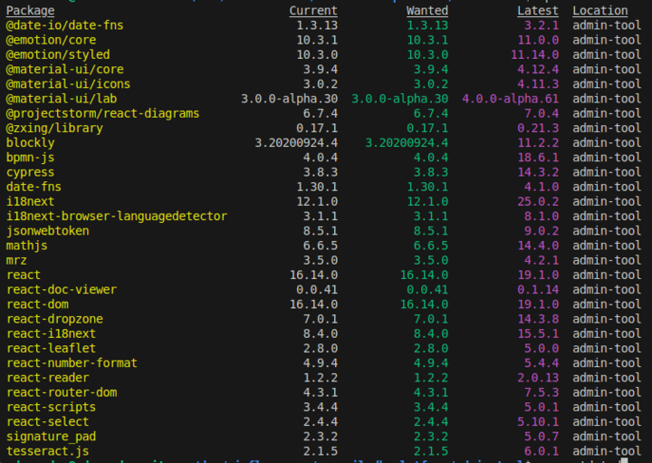

# Análisis dependencias

- Muchas dependencias están **2, 3 o más versiones major por detrás** (ej: `react`, `react-dom`, `material-ui`, `cypress`, `date-fns`, `i18next`, etc.).
- Esto implica que el esfuerzo de migración es alto y el riesgo de vulnerabilidades es real y creciente.

### 1. Riesgos de seguridad

- Las versiones antiguas de librerías suelen tener **vulnerabilidades conocidas** que los atacantes pueden explotar. Los parches de seguridad solo se publican en versiones recientes.

### 2. Problemas de mantenimiento

- Las APIs cambian entre versiones major, por lo que cuanto más tiempo pasa, más difícil y costosa es la migración (puede requerir refactorizaciones grandes).
- Las sub-dependencias también pueden quedar obsoletas, generando un efecto cascada.
- La comunidad y los foros tienden a enfocarse en versiones recientes, dificultando encontrar soporte o ejemplos para versiones viejas.

### 3. Compatibilidad y nuevas funcionalidades

- No se pueden aprovechar nuevas características, mejoras de rendimiento o integraciones modernas.
- Algunas herramientas o servicios externos pueden dejar de funcionar con versiones antiguas.

---

## Ejemplo concreto de vulnerabilidad: `jsonwebtoken@8.5.1`

- **Vulnerabilidad**: CVE-2022-23529 (y otras asociadas a versiones anteriores a la 9.0.0)
- **Descripción**: Permite, bajo ciertas condiciones, ejecución remota de código (RCE) si un atacante puede manipular el parámetro `secretOrPublicKey` en la función `jwt.verify()`. Esto puede ocurrir si la gestión de claves es insegura o si hay una mala configuración.
- **Impacto**: Un atacante podría ejecutar código arbitrario en el servidor, comprometiendo la integridad y confidencialidad de la aplicación.
- **Solución**: Actualizar a `jsonwebtoken` 9.0.0 o superior, donde se han añadido controles de tipo y validaciones adicionales para evitar este tipo de ataques.
- **Referencias**:
  - [Snyk - jsonwebtoken@8.5.1 vulnerabilities](https://security.snyk.io/package/npm/jsonwebtoken/8.5.1)
  - [Unit42 - JWT Secret Poisoning](https://unit42.paloaltonetworks.com/jsonwebtoken-vulnerability-cve-2022-23529/)
  - [GitHub Advisory Database](https://github.com/advisories/GHSA-27h2-hvpr-p74q)

---

## Evaluación de la dificultad de migración de librerías

Este informe estima la dificultad de migrar cada librería desde su versión actual a la última versión, calificada de \* (más fácil) a \*\*\*\* (más difícil). La lista está ordenada por dificultad creciente.

#### signature_pad (\*)

- **Versión actual:** 2.3.2
- **Última versión:** 5.0.7
- **Dificultad percibida:** \*
- **Razón:** La API de signature pad es relativamente estable. Si bien es probable que haya nuevas características y mejoras, la funcionalidad principal probablemente no haya sufrido cambios drásticos que requieran una reescritura importante para la mayoría de los casos de uso.

#### mrz (\*)

- **Versión actual:** 3.5.0
- **Última versión:** 4.2.1
- **Dificultad percibida:** \*
- **Razón:** Los saltos de versiones menores generalmente involucran correcciones de errores y adiciones de características más pequeñas. La lógica central de análisis MRZ probablemente se mantenga consistente.

#### jsonwebtoken (\*\*)

- **Versión actual:** 8.5.1
- **Última versión:** 9.0.2
- **Dificultad percibida:** \*\*
- **Razón:** Si bien el estándar JWT central es estable, las actualizaciones pueden involucrar cambios en los algoritmos admitidos, el manejo de claves o el manejo de errores. Sería necesario revisar las notas de la versión para cualquier cambio de API que rompa la compatibilidad.

#### react-doc-viewer (\*\*)

- **Versión actual:** 0.0.41
- **Última versión:** 0.1.14
- **Dificultad percibida:** \*\*
- **Razón:** Pasar de una versión 0.x.y a una versión 0.x.y ligeramente superior podría incluir ajustes de API o correcciones de errores que podrían requerir cambios menores en el código, pero es poco probable que sea una revisión completa.

#### react-number-format (\*\*)

- **Versión actual:** 4.9.4
- **Última versión:** 5.4.4
- **Dificultad percibida:** \*\*
- **Razón:** Un salto de v4 a v5 podría introducir cambios en cómo se manejan las opciones de formato o cómo el componente se integra con las bibliotecas de formularios. Las pruebas serían importantes.

#### @zxing/library (\*\*)

- **Versión actual:** 0.17.1
- **Última versión:** 0.21.3
- **Dificultad percibida:** \*\*
- **Razón:** Si bien todavía está en el rango 0.x, varias actualizaciones de versiones menores podrían incluir refinamientos de API o cambios en cómo se configura y maneja el proceso de escaneo de códigos de barras.

#### @emotion/core (\*\*)

- **Versión actual:** 10.3.1
- **Última versión:** 11.0.0
- **Dificultad percibida:** \*\*
- **Razón:** Un salto de versión principal (v10 a v11) a menudo incluye cambios que rompen la compatibilidad, particularmente en las bibliotecas de estilos. Revisar las guías de migración oficiales de Emotion para v11 será crucial.

#### @emotion/styled (\*\*)

- **Versión actual:** 10.3.0
- **Última versión:** 11.14.0
- **Dificultad percibida:** \*\*
- **Razón:** Similar a `@emotion/core`, la actualización de la versión principal a v11 es el factor clave. Si bien es menos probable que las actualizaciones menores dentro de v11 rompan cosas, el movimiento inicial requerirá atención.

#### react-reader (\*\*)

- **Versión actual:** 1.2.2
- **Última versión:** 2.0.13
- **Dificultad percibida:** \*\*
- **Razón:** Un movimiento de v1 a v2 típicamente indica posibles cambios que rompen la compatibilidad en la API del componente, cómo maneja los formatos de libros o su manejo de eventos.

#### react-select (\*\*\*)

- **Versión actual:** 2.4.4
- **Última versión:** 5.10.1
- **Dificultad percibida:** \*\*\*
- **Razón:** Un salto significativo de v2 a v5 probablemente involucra cambios sustanciales en la API sobre cómo se manejan, se les da estilo y se interactúa con las opciones. Las personalizaciones podrían necesitar actualizaciones significativas.

#### @date-io/date-fns (\*\*\*)

- **Versión actual:** 1.3.13
- **Última versión:** 3.2.1
- **Dificultad percibida:** \*\*\*
- **Razón:** Pasar por dos versiones principales en una biblioteca de fecha y hora puede introducir cambios significativos en cómo se manejan, se formatean y se manipulan los objetos de fecha. La biblioteca subyacente `date-fns` también tuvo actualizaciones importantes.

#### @mui/icons-material (anteriormente @material-ui/icons) (\*\*\*)

- **Versión actual:** 3.0.2
- **Última versión:** 5.15.14
- **Dificultad percibida:** \*\*\*
- **Razón:** Al alinearse con los cambios de versión principal en Material UI (ahora MUI), la forma en que se importan y utilizan los iconos podría haber cambiado. También podría haber cambios en los conjuntos de iconos disponibles o en las convenciones de nomenclatura.

#### react-dropzone (\*\*\*)

- **Versión actual:** 7.0.1
- **Última versión:** 14.3.8
- **Dificultad percibida:** \*\*\*
- **Razón:** Un salto a través de varias versiones principales en una biblioteca de manejo de archivos podría involucrar cambios en la API para manejar archivos arrastrados, administrar el estado o personalizar el comportamiento de arrastrar y soltar.

#### react-i18next (\*\*\*)

- **Versión actual:** 8.4.0
- **Última versión:** 15.5.1
- **Dificultad percibida:** \*\*\*
- **Razón:** Las actualizaciones de versiones principales en las bibliotecas de internacionalización pueden afectar cómo se cargan las traducciones, cómo se accede a ellas y cómo se maneja el cambio de idioma. La biblioteca central `i18next` también ha experimentado una evolución significativa.

#### react-leaflet (\*\*\*)

- **Versión actual:** 2.8.0
- **Última versión:** 5.0.0
- **Dificultad percibida:** \*\*\*
- **Razón:** Pasar de v2 a v5 en una biblioteca de mapas podría involucrar cambios significativos en cómo se estructuran los componentes del mapa, cómo se manejan los eventos y cómo se integran los complementos o las extensiones.

#### react-router-dom (\*\*\*)

- **Versión actual:** 4.3.1
- **Última versión:** 7.5.3
- **Dificultad percibida:** \*\*\*
- **Razón:** React Router ha experimentado cambios arquitectónicos significativos entre v4 y v6 (y ahora v7). Esta migración probablemente involucrará actualizaciones sustanciales en las definiciones de rutas, la lógica de navegación y cómo se accede a los parámetros de las rutas.

#### @mui/lab (anteriormente @material-ui/lab) (\*\*\*)

- **Versión actual:** 3.0.0-alpha.30
- **Última versión:** 7.0.0-alpha.117
- **Dificultad percibida:** \*\*\*
- **Razón:** Pasar de una versión alfa temprana de v3 a una versión alfa posterior de v7 sugiere una evolución de la API potencialmente significativa y cambios en los componentes experimentales que ofrece el paquete lab.

#### cypress (\*\*\*\*)

- **Versión actual:** 3.8.3
- **Última versión:** 14.3.2
- **Dificultad percibida:** \*\*\*\*
- **Razón:** Cypress ha experimentado actualizaciones sustanciales en estas versiones principales, incluidos cambios arquitectónicos, nuevas características y posibles cambios que rompen la compatibilidad en cómo se estructuran, configuran y ejecutan las pruebas. Podrían ser necesarias reescrituras de pruebas.

#### @mui/material (anteriormente @material-ui/core) (\*\*\*\*)

- **Versión actual:** 3.9.4
- **Última versión:** 7.0.2
- **Dificultad percibida:** \*\*\*\*
- **Razón:** Migrar a través de múltiples versiones principales de una biblioteca de interfaz de usuario central como Material UI (ahora MUI) es una tarea significativa. Espere cambios que rompan la compatibilidad en las API de los componentes, la tematización, el estilo y potencialmente la estructura general de su código de interfaz de usuario. La migración incremental a través de las guías de cada versión principal es esencial.

#### blockly (\*\*\*\*)

- **Versión actual:** 3.20200924.4
- **Última versión:** 11.2.2
- **Dificultad percibida:** \*\*\*\*
- **Razón:** Pasar de una versión lanzada en 2020 a la última v11 representa un salto masivo. Espere cambios significativos en la API, cómo se definen los bloques, cómo funciona el espacio de trabajo y cómo se implementan los bloques y las extensiones personalizadas. Es muy probable que sea necesaria una reescritura sustancial.

#### bpmn-js (\*\*\*\*)

- **Versión actual:** 4.0.4
- **Última versión:** 18.6.1
- **Dificultad percibida:** \*\*\*\*
- **Razón:** Un salto de v4 a v18 en una biblioteca compleja como `bpmn-js` casi con certeza involucrará cambios arquitectónicos importantes, rupturas de API y actualizaciones sobre cómo se renderizan, se interactúa y se extienden los diagramas BPMN. Espere un esfuerzo significativo.

#### date-fns (\*\*\*\*)

- **Versión actual:** 1.30.1
- **Última versión:** 4.1.0
- **Dificultad percibida:** \*\*\*\*
- **Razón:** El movimiento de v1 a v4 de `date-fns` incluye los importantes lanzamientos v2 y v3, que introdujeron cambios sustanciales en la API, incluida la introducción de objetos de fecha inmutables y soporte de zona horaria de primera clase. Esto probablemente requerirá una revisión exhaustiva y una actualización de todo el código relacionado con las fechas.

#### i18next (\*\*\*\*)

- **Versión actual:** 12.1.0
- **Última versión:** 25.0.2
- **Dificultad percibida:** \*\*\*\*
- **Razón:** Saltar a través de tantas versiones principales en una biblioteca de internacionalización puede afectar cómo se cargan las traducciones, los espacios de nombres, las reglas de pluralización y la integración con los marcos de interfaz de usuario. Será necesaria una revisión detallada de los registros de cambios de cada versión principal, y es probable que se necesiten ajustes de código significativos.

#### react (\*\*\*\*)

- **Versión actual:** 16.14.0
- **Última versión:** 19.1.0
- **Dificultad percibida:** \*\*\*\*
- **Razón:** Migrar a través de tres versiones principales de React (v17, v18 y v19) involucra cambios significativos como la introducción de nuevas API (por ejemplo, Hooks en v16.8, pero la adopción podría ser limitada en bases de código más antiguas), actualizaciones arquitectónicas (Renderizado Concurrente en v18) y posibles obsolescencias. Una comprensión profunda de los cambios de cada versión y pruebas cuidadosas son esenciales.

#### react-dom (\*\*\*\*)

- **Versión actual:** 16.14.0
- **Última versión:** 19.1.0
- **Dificultad percibida:** \*\*\*\*
- **Razón:** Como `react-dom` sigue de cerca el versionado de React, se aplica el mismo razonamiento y nivel de dificultad. Los cambios en el motor de renderizado y el manejo de eventos de React requerirán actualizaciones cuidadosas en el uso de `react-dom` también.

#### react-scripts (\*\*\*\*)

- **Versión actual:** 3.4.4
- **Última versión:** 5.0.1
- **Dificultad percibida:** \*\*\*\*
- **Razón:** Si bien parece un salto de versión menor, `react-scripts` a menudo incluye cambios subyacentes significativos en el proceso de construcción, las configuraciones de webpack y las características admitidas. La migración podría implicar la actualización de las configuraciones, el manejo de cambios en los comportamientos predeterminados y la posible resolución de problemas de compatibilidad con otras dependencias.

**Notas Importantes:**

- Esta es una evaluación general. La dificultad real dependerá de cuán extensamente se utilice cada biblioteca en su proyecto específico y de la complejidad de su implementación actual.
- Consulte siempre las guías de migración y las notas de la versión oficiales de cada biblioteca para obtener la información más precisa y detallada.
- Considere las actualizaciones incrementales siempre que sea posible, avanzando paso a paso por cada versión principal.
- Las pruebas exhaustivas son cruciales después de cualquier migración de biblioteca.
