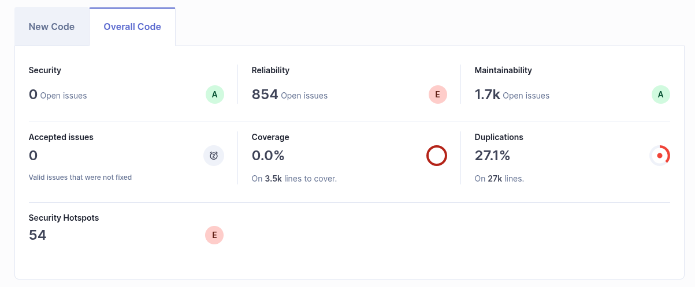

# Análisis estático del código

- Se ha realizado un análisis stático del código con Sonar, encontrando un gran porcentaje de código duplicado y un número muy elevado de issues en los apartados de _Reliability_ (fiabilidad, relacionado con errores en tiempo de ejecución) y _Maintainability_ (mantenibilidad)

- Se auditará la base de código nueva para evaluar la mejora.
