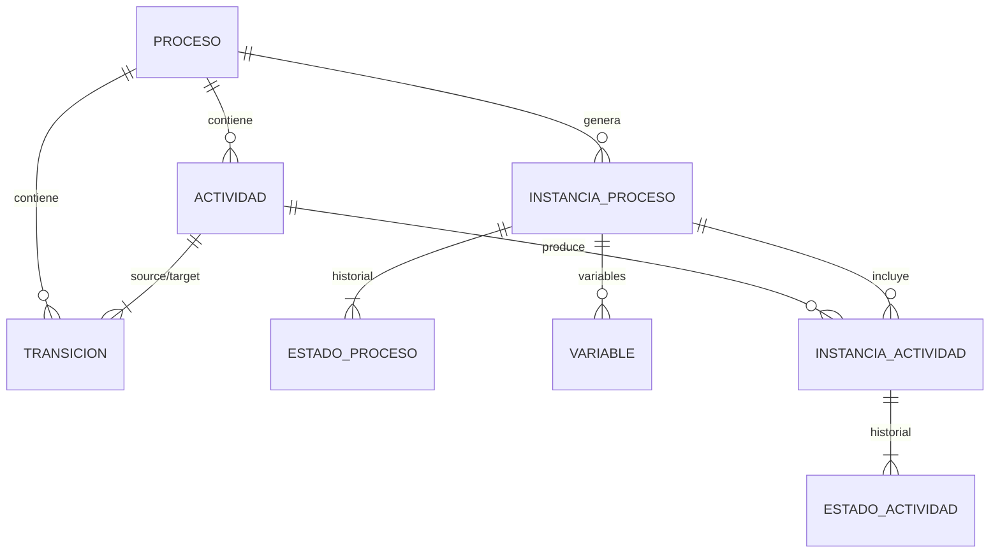

# Modelo de datos de workflows

- [Modelo de datos de workflows](#modelo-de-datos-de-workflows)
  - [Diagrama ER](#diagrama-er)
  - [Entidades principales](#entidades-principales)
    - [Proceso (Workflow)](#proceso-workflow)
    - [Actividad](#actividad)
    - [Transicion](#transicion)
    - [Instancia de Proceso (Workflow)](#instancia-de-proceso-workflow)
    - [Estado de Proceso (Workflow)](#estado-de-proceso-workflow)
    - [Instancia de Actividad](#instancia-de-actividad)
    - [Estado de Actividad](#estado-de-actividad)
    - [Variable](#variable)
  - [Relaciones](#relaciones)

## Diagrama ER

## Entidades principales

### Proceso (Workflow)  
Definición estática de un flujo de trabajo.  
Campos clave:  
• id, name, description, version  
• activities (lista)  
• transitions (lista)

### Actividad  
Nodo dentro de un proceso.  
Campos clave:  
• id, name, type (START, HUMAN_TASK, FUNCTION, etc.)  
• description, agent/function opcional  
• proceso (workflow) (FK)  
• transitions de salida/entrada

### Transicion  
Arista que conecta dos actividades.  
Campos clave:  
• id, sourceActivity, targetActivity (FK)  
• conditionFunction, conditionResult, state

### Instancia de Proceso (Workflow)  
Ejecución concreta de un proceso.  
Campos clave:  
• id, proceso (workflow) (FK), businessKey, creationDate, status  
• state (historial)  
• activityInstances (lista)  
• variables (lista)

### Estado de Proceso (Workflow)  
Registro cronológico de la evolución de una instancia.  
Campos clave:  
• id, workflowInstance (FK), state, timestamp

### Instancia de Actividad  
Trabajo (task) que deriva de una actividad durante la ejecución.  
Campos clave:  
• id, activity (FK), workflowInstance (FK)  
• assignee, status, result, logActivity  
• state (historial)

### Estado de Actividad  
Registro cronológico del avance de una instancia de actividad.  
Campos clave:  
• id, activityInstance (FK), state, timestamp

### Variable  
Dato dinámico asociado a una instancia de proceso (workflow).  
Campos clave:  
• id, workflowInstance (FK), name, description, type  
• value* según el tipo (Boolean, Number, Date, String)

---

## Relaciones

* Un **Proceso (Workflow)** contiene muchas **Actividades** y muchas **Transiciones**.  
* Una **Transición** conecta dos **Actividades** (source / target).  
* Un **Proceso (Workflow)** genera muchas **Instancias de proceso (workflow)**.  
* Cada **Instancia de proceso (workflow)** guarda un historial (**Estados de proceso (workflow)**) y variables, y genera **Instancias de actividad**.  
* Una **Instancia de actividad** pertenece tanto a una **Actividad** como a una **Instancia de proceso (workflow)**, y guarda su propio historial (**Estados de actividad**).

---

